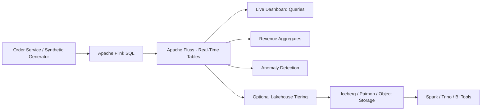
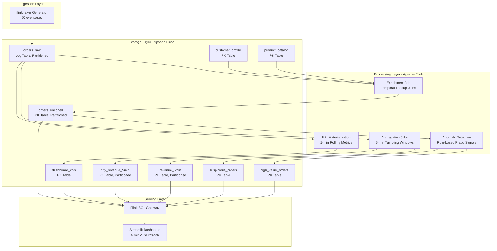
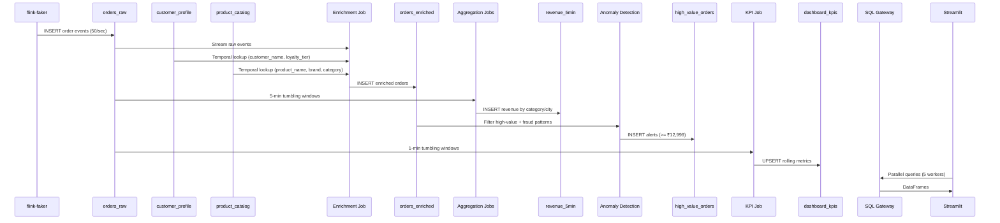
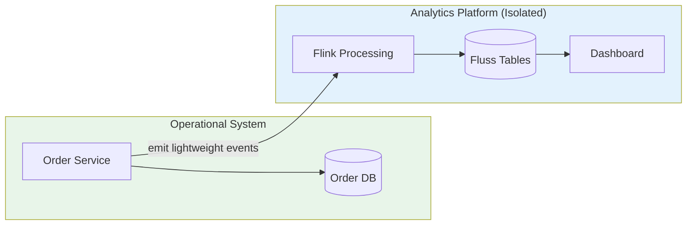

# Real-Time E-commerce Order Intelligence with Apache Fluss

A production-grade real-time e-commerce analytics platform demonstrating **Apache Fluss** + **Apache Flink SQL** for streaming order intelligence — from raw event ingestion to enriched analytics, anomaly detection, and live dashboards.

## Business Problem

E-commerce companies processing millions of orders daily need real-time visibility into revenue, payments, fraud signals, and customer behavior **without impacting operational systems**.

Traditional approaches suffer from:
- **Operational DB overload** — analytics queries compete with order placement
- **Batch staleness** — lakehouse data is minutes to hours behind
- **Pipeline complexity** — Kafka + Flink + Iceberg + Trino = 4+ systems to manage
- **Large state costs** — unbounded Flink joins consume expensive memory

## Solution Architecture



### Multi-Layer Architecture



## Technical Implementation — End-to-End Flow



## Data Flow Summary

1. **Generate** — flink-faker produces 50 realistic order events/sec with weighted distributions
2. **Store Raw** — Append-only log table partitioned by day, 8 buckets, 7-day retention
3. **Enrich** — Temporal joins resolve customer/product dimensions in real-time
4. **Aggregate** — 5-minute windows compute revenue by category and city
5. **Detect Anomalies** — Rule-based fraud signals with calibrated thresholds
6. **Pre-Materialize** — 1-minute KPIs for instant dashboard reads
7. **Serve** — SQL Gateway serves parallel queries to Streamlit dashboard

## Tech Stack

| Component | Technology | Purpose |
|-----------|-----------|---------|
| Streaming Storage | Apache Fluss 0.9.0 | Real-time queryable tables |
| Stream Processing | Apache Flink 1.20 | SQL-based ETL pipelines |
| Data Generation | flink-faker | Synthetic order events |
| Coordination | Apache ZooKeeper 3.9.2 | Fluss cluster coordination |
| Query Gateway | Flink SQL Gateway | REST API for SQL queries |
| Dashboard | Streamlit + Plotly | Real-time analytics UI |
| Orchestration | Docker Compose | Local development environment |

## Use Cases Demonstrated

- **Real-time revenue monitoring** — by category, city, payment method, loyalty tier
- **Failed payment detection** — percentage tracking and alerting
- **High-value order alerts** — orders >= ₹12,999 flagged immediately
- **Fraud signal detection** — multi-rule pattern matching (COD abuse, failed high-value, etc.)
- **Customer enrichment** — real-time denormalization via temporal joins
- **Product analytics** — top products by revenue, inventory risk signals
- **Pre-materialized KPIs** — sub-second dashboard metrics via streaming aggregation
- **Large-volume patterns** — partitioning, bucketing, auto-retention for scale

## Quick Start

```bash
# Clone and start
git clone https://github.com/Yogi776/Real-Time-E-commerce-Order-Intelligence-with-Apache-Fluss.git
cd Real-Time-E-commerce-Order-Intelligence-with-Apache-Fluss

# Start all services
chmod +x scripts/*.sh
./scripts/start.sh

# Open Flink SQL client and run pipelines
./scripts/open-sql-client.sh

# Inside SQL client, run in order:
#   sql/01_create_catalog.sql
#   sql/02_create_tables.sql
#   sql/03_seed_data.sql
#   sql/04_generate_orders.sql    (streaming - runs continuously)
#   sql/05_enrich_orders.sql      (streaming - runs continuously)
#   sql/06_revenue_aggregates.sql (streaming - runs continuously)
#   sql/08_anomaly_detection.sql  (streaming - runs continuously)
#   sql/10_dashboard_kpis.sql     (streaming - runs continuously)

# Start dashboard (separate terminal)
pip install -r dashboard/requirements.txt
streamlit run dashboard/streamlit_app.py
```

### Access Points

| Service | URL |
|---------|-----|
| Flink Web UI | http://localhost:8084 |
| SQL Gateway | http://localhost:8085 |
| Streamlit Dashboard | http://localhost:8501 |

## Data Model Overview

| Table | Type | Partitioned | Buckets | Purpose |
|-------|------|------------|---------|---------|
| `orders_raw` | Log (append) | By day | 8 | Raw immutable events |
| `customer_profile` | PK (upsert) | No | 4 | Customer dimension |
| `product_catalog` | PK (upsert) | No | 4 | Product dimension |
| `orders_enriched` | PK (upsert) | By day | 16 | Denormalized facts |
| `revenue_5min` | PK (upsert) | By day | 8 | Category revenue windows |
| `city_revenue_5min` | PK (upsert) | By day | 8 | City revenue windows |
| `high_value_orders` | PK (upsert) | No | 4 | High-value alerts |
| `suspicious_orders` | PK (upsert) | No | 4 | Fraud signals |
| `dashboard_kpis` | PK (upsert) | No | 4 | Pre-materialized metrics |

## Large Data Volume Strategy

- **Partition by day** — auto-retention drops data older than 7 days
- **Increased buckets** — 8-16 buckets per partition for parallel I/O
- **Pre-materialized KPIs** — dashboard reads 5 rows instead of scanning 50K+
- **Bounded windows** — 5-minute tumbling windows bound state size
- **Temporal joins** — lookup joins avoid unbounded state from regular joins
- **Parallel dashboard** — 5 concurrent query workers, loads in ~10s

For production scale (10K-100K events/sec):
- Increase `bucket.num` to 32-64 per partition
- Add TabletServers (1 per 10K events/sec)
- Match Flink TaskManager parallelism to bucket count
- Use `sink.distribution-mode = 'BUCKET'` for PK table writes

## Performance Optimization

- **Flink parallelism** — match to bucket count for full throughput
- **Checkpoint interval** — 60s default, reduce for lower latency
- **Event-time watermarks** — 5s allowed lateness for ordered processing
- **Aggregate tables** — query pre-computed results, not raw events
- **LIMIT scans** — dashboard samples 500 rows for distribution charts
- **Session reuse** — SQL Gateway sessions persist across queries
- **Pagination** — client follows all result pages for complete data

## Reliability & Fault Tolerance

- **Flink checkpointing** — exactly-once state snapshots every 60s
- **Restart strategy** — fixed-delay with 3 attempts, 10s interval
- **Idempotent writes** — PK tables naturally handle duplicate inserts
- **Replay from raw** — orders_raw is the source of truth for reprocessing
- **Auto-partition retention** — prevents unbounded storage growth
- **Health checks** — all Docker services have liveness probes

## Observability

Key metrics to monitor:
- Input events/sec (target: 50, scalable to 5000+)
- Flink backpressure (should stay < 50%)
- Checkpoint duration (target: < 10s)
- Consumer lag (target: < 60s)
- Dashboard load time (target: < 15s)
- Failed payment rate (baseline: ~17%)

## Fluss vs Traditional Architecture

| Aspect | Kafka + Flink + Iceberg | Fluss + Flink |
|--------|------------------------|---------------|
| Systems to manage | 4+ (Kafka, Flink, Iceberg, Trino) | 2 (Fluss, Flink) |
| Real-time queries | Need separate serving DB | Native on Fluss tables |
| Data freshness | Minutes (batch commit) | Milliseconds |
| Small files problem | Yes (frequent commits) | No (streaming storage) |
| Operational complexity | High | Low |
| Lakehouse integration | Native | Tiering (Phase 2) |

## How This Architecture Prevents System Impact



- Order service only emits events and returns quickly
- No dashboard queries run against the operational database
- Heavy joins and aggregations happen in isolated Flink jobs
- Backpressure is contained within the streaming pipeline
- Load testing the analytics layer has zero impact on order placement

## Production Readiness Notes

This repository is a **local development demo**. Production deployment requires:
- Multi-node Fluss cluster with dedicated TabletServers
- Security (TLS, authentication, authorization)
- Persistent volumes and backup/recovery
- Resource limits and autoscaling
- Schema governance and data quality checks
- CI/CD pipeline with automated testing
- Monitoring, alerting, and runbooks

## Known Limitations

- Local Docker Compose is not production-grade
- Apache Fluss is still in Apache Incubator (0.9.x)
- SQL Gateway batch mode doesn't support WHERE on partition keys
- Connector syntax may vary between Fluss/Flink versions
- Lakehouse tiering documented as Phase 2

## Repository Structure

```
├── README.md                    # This file
├── docker-compose.yml           # Local development services
├── .gitignore                   # Git ignore rules
├── sql/
│   ├── 01_create_catalog.sql    # Fluss catalog setup
│   ├── 02_create_tables.sql     # Table DDL with partitioning
│   ├── 03_seed_data.sql         # Customer/product seed data
│   ├── 04_generate_orders.sql   # flink-faker order generator
│   ├── 05_enrich_orders.sql     # Enrichment pipeline
│   ├── 06_revenue_aggregates.sql# Windowed aggregations
│   ├── 07_large_volume_simulation.sql # Scale testing guide
│   ├── 08_anomaly_detection.sql # Fraud signal detection
│   ├── 09_demo_queries.sql      # Interactive demo queries
│   └── 10_dashboard_kpis.sql    # Pre-materialized KPIs
├── datagen/
│   └── generate_seed_data.py    # Seed data generator script
├── dashboard/
│   ├── streamlit_app.py         # Real-time analytics dashboard
│   ├── flink_gateway_client.py  # SQL Gateway REST client
│   └── requirements.txt         # Python dependencies
├── scripts/
│   ├── start.sh                 # Start all services
│   ├── stop.sh                  # Stop services
│   ├── open-sql-client.sh       # Open Flink SQL client
│   ├── run-demo.sh              # Guided demo runner
│   ├── validate.sh              # Repository validation
│   └── load-test-notes.sh       # Load testing instructions
└── docs/
    ├── architecture.md          # High-level architecture
    ├── solution-architecture.md # Detailed solution design
    ├── system-design.md         # System design document
    ├── data-model.md            # Table-by-table explanation
    ├── large-volume-handling.md # Scale strategy
    ├── performance-optimization.md # Tuning guide
    ├── reliability-and-fault-tolerance.md # Failure handling
    ├── observability.md         # Metrics and monitoring
    ├── fluss-vs-current-architecture.md # Architecture comparison
    ├── phase-2-lakehouse-tiering.md # Future lakehouse plan
    └── production-readiness-checklist.md # Deployment checklist
```

## License

This project is for educational and demonstration purposes.
