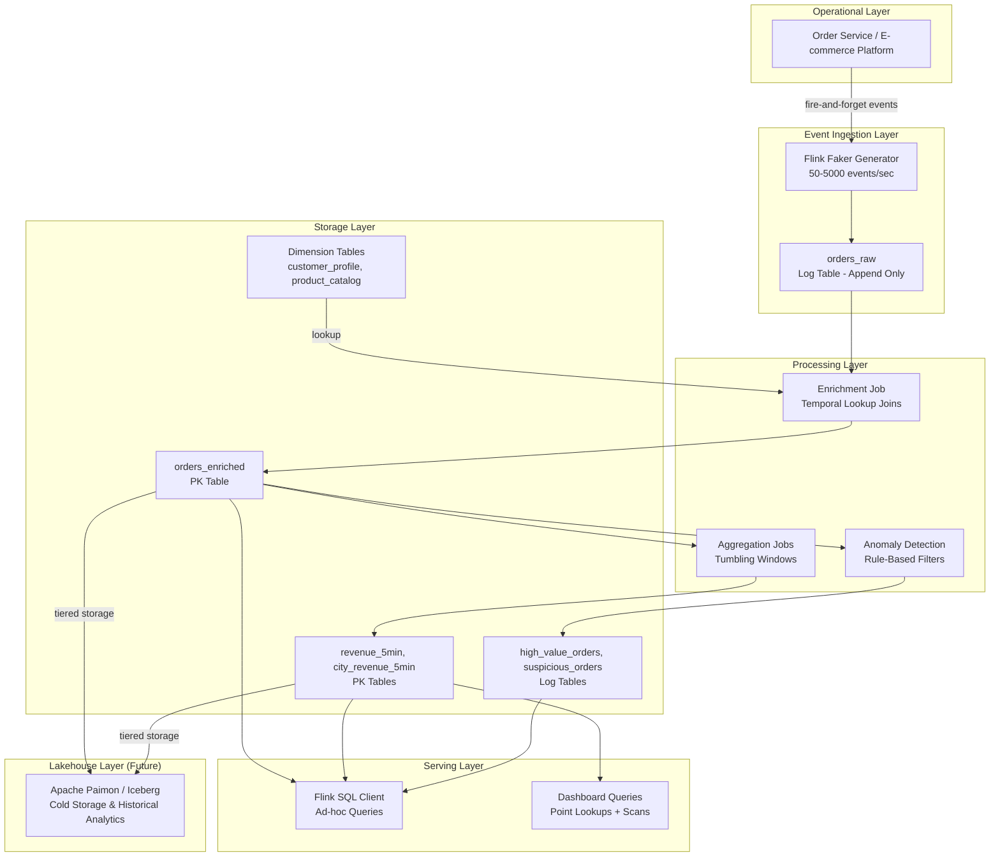
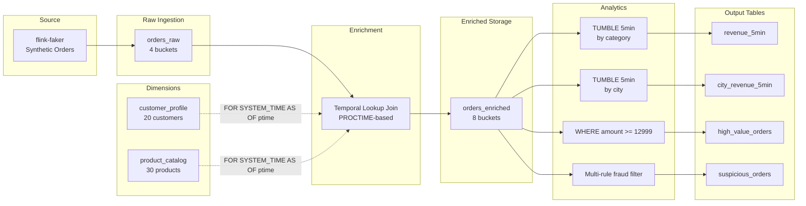
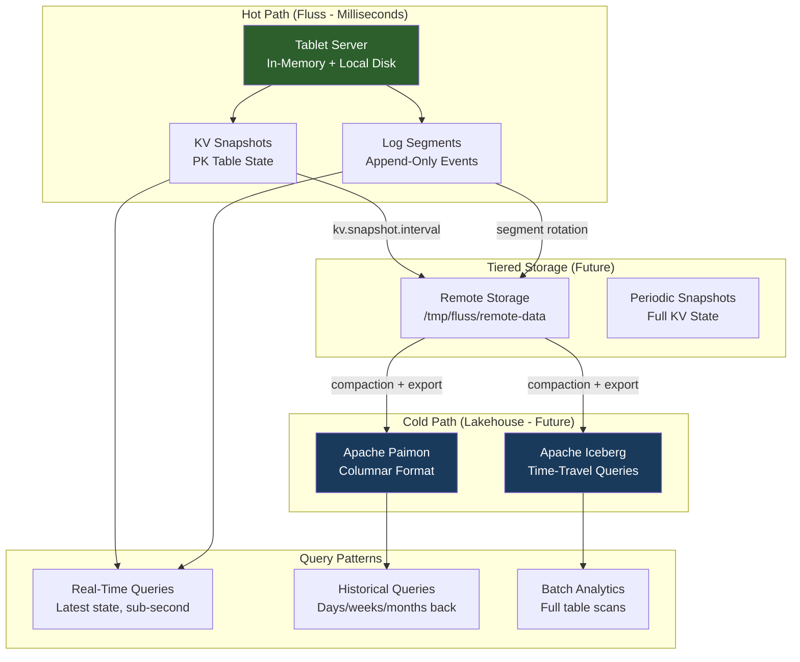
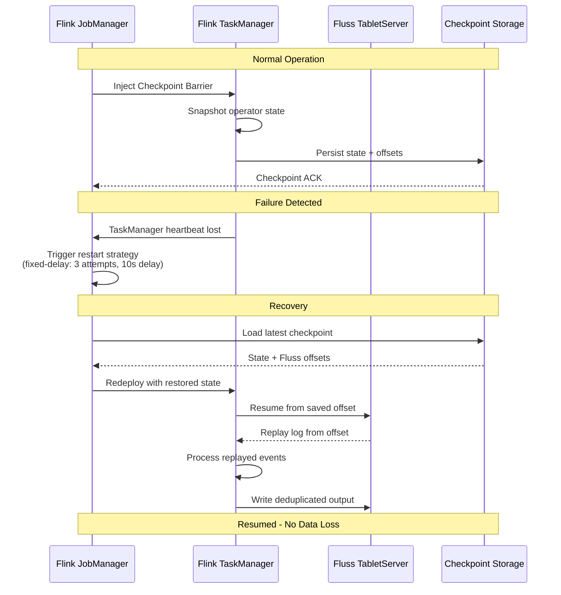
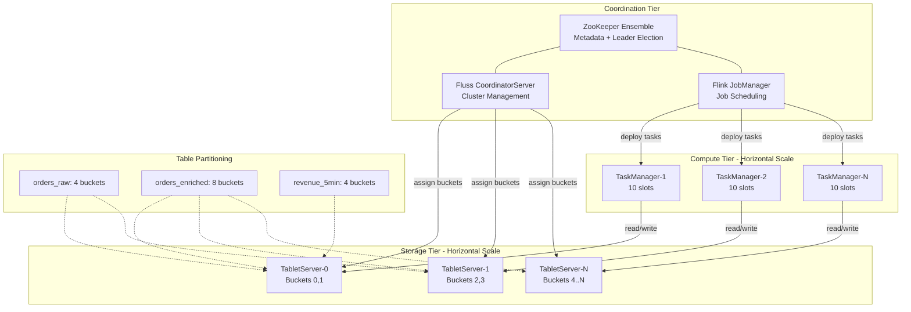

# Architecture Overview

This document describes the high-level architecture of the Real-Time E-commerce Order Intelligence Platform built on Apache Fluss (incubating) and Apache Flink SQL.

## Technology Stack

| Component | Technology | Version |
|-----------|-----------|---------|
| Streaming Storage | Apache Fluss | 0.9.0-incubating |
| Stream Processing | Apache Flink SQL | 1.20 |
| Coordination | Apache ZooKeeper | 3.9.2 |
| Data Generation | Flink Faker Connector | - |
| Deployment | Docker Compose | - |

---

## A. Logical Architecture

The platform is organized into six logical layers, each with a distinct responsibility.

---

## B. Data Flow

End-to-end data flow from event generation through enrichment, aggregation, and anomaly detection to queryable results.

---

## C. Hot/Cold Storage Architecture

Fluss provides hot storage for real-time serving with sub-second latency. Cold storage (lakehouse) handles historical queries and long-term retention.

**Current Configuration:**
- `kv.snapshot.interval: 0s` (snapshots disabled for development)
- `remote.data.dir: /tmp/fluss/remote-data` (local tmpfs in Docker)
- Lakehouse integration is a planned future extension via Fluss tiered storage

---

## D. Failure Recovery Flow

Flink's checkpoint-based recovery combined with Fluss's log replay provides exactly-once semantics for stateful processing.

**Configured Recovery Parameters:**
- Checkpointing interval: 30 seconds
- Minimum pause between checkpoints: 10 seconds
- Restart strategy: fixed-delay (3 attempts, 10-second delay)
- Checkpoint storage: `file:///tmp/flink-checkpoints`

---

## E. Scaling Architecture

The platform scales horizontally by adding Fluss Tablet Servers (storage parallelism) and Flink TaskManagers (compute parallelism).

**Scaling Dimensions:**

| Dimension | Mechanism | Current | Scale Target |
|-----------|-----------|---------|--------------|
| Ingestion throughput | Add TabletServers + increase buckets | 1 TS, 4 buckets | N TS, 32+ buckets |
| Processing parallelism | Add TaskManagers + increase slots | 1 TM, 10 slots | N TM, 10 slots each |
| Storage capacity | Add TabletServers with local SSDs | 1 TS (tmpfs) | N TS (NVMe) |
| Query concurrency | Add TaskManagers for SQL client sessions | 1 TM | N TM |

**Scaling Procedure:**
1. Add new TabletServer instances to Docker Compose with unique `tablet-server.id`
2. Increase `bucket.num` on tables that need more parallelism (requires table recreation)
3. Add TaskManager replicas via `docker compose up --scale taskmanager=N`
4. CoordinatorServer automatically rebalances bucket assignments

---

## Notes on Apache Fluss Maturity

Apache Fluss is incubating software under the Apache Software Foundation. This means:

- The API surface may change between releases
- Production deployment patterns are still being established by the community
- Tiered storage and lakehouse integration are actively under development
- The 0.9.0-incubating release is the first public release suitable for evaluation and development

This architecture is designed for demonstration and evaluation purposes. Production deployments should track the Fluss release notes and community guidance for stability guarantees.
