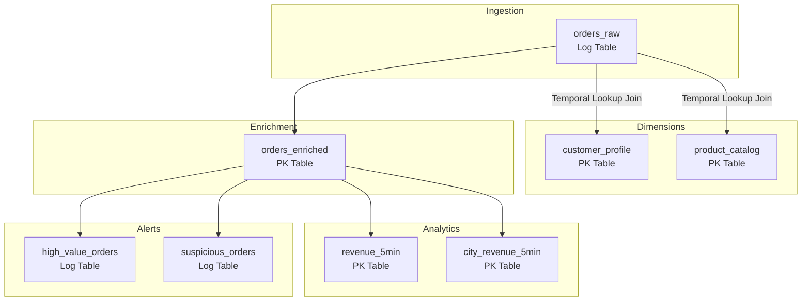
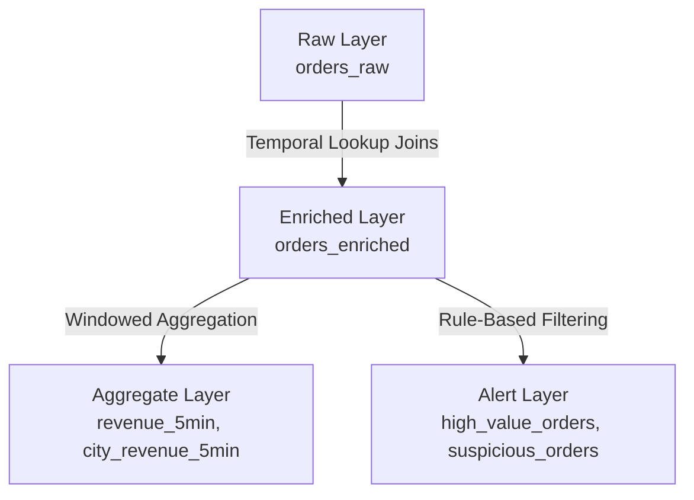
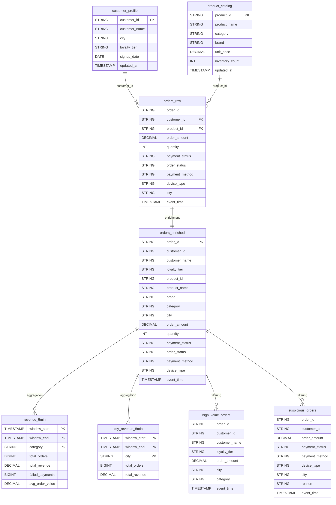

# Data Model

Complete reference for the data model powering the Real-Time E-commerce Order Intelligence Platform. Covers every table, field, design decision, and access pattern.

---

## Table Overview

The platform uses 8 tables organized into three layers: ingestion, enrichment, and analytics.

| Table | Layer | Table Type | Primary Key | Bucket Count | Purpose |
|---|---|---|---|---|---|
| `orders_raw` | Ingestion | Log (append-only) | None | 4 | Raw order events as received |
| `customer_profile` | Dimension | PK (upsert) | `customer_id` | 4 | Customer attributes for enrichment |
| `product_catalog` | Dimension | PK (upsert) | `product_id` | 4 | Product attributes for enrichment |
| `orders_enriched` | Enrichment | PK (upsert) | `order_id` | 8 | Fully denormalized order facts |
| `revenue_5min` | Analytics | PK (upsert) | `(window_start, window_end, category)` | 4 | Revenue metrics by category per 5-min window |
| `city_revenue_5min` | Analytics | PK (upsert) | `(window_start, window_end, city)` | 4 | Revenue metrics by city per 5-min window |
| `high_value_orders` | Alerts | Log (append-only) | None | 4 | Orders exceeding the high-value threshold |
| `suspicious_orders` | Alerts | Log (append-only) | None | 4 | Orders matching fraud-like patterns |

---

## Table Type Rationale

Fluss supports two table types, and each table in the platform uses the type that matches its semantics.

### Log Tables (Append-Only)

Log Tables store an immutable, ordered sequence of records. New records are appended; existing records are never updated or deleted. This is appropriate for:

- **`orders_raw`**: Raw events must be preserved exactly as received. No record should ever be overwritten. The log is the source of truth for what the order service emitted.
- **`high_value_orders`**: Each detection of a high-value order is a distinct event. Even if the same order triggers the rule multiple times (e.g., after a re-enrichment), each occurrence is independently valuable for audit.
- **`suspicious_orders`**: Same as above. Each fraud signal is an independent alert event. Append-only semantics ensure no alert is silently overwritten or lost.

### PK Tables (Upsert)

PK Tables store the latest version of each record, keyed by a primary key. Writes with the same key overwrite the previous value. This is appropriate for:

- **`customer_profile`**: A customer's name, city, or loyalty tier can change. The table should always reflect the current state.
- **`product_catalog`**: Product prices, inventory counts, and categories change. Point lookups during enrichment must return the latest values.
- **`orders_enriched`**: Keyed by `order_id`. If an order is re-enriched (e.g., after a dimension update), the enriched record is upserted rather than duplicated.
- **`revenue_5min`** and **`city_revenue_5min`**: Keyed by the composite `(window_start, window_end, dimension)`. As a tumbling window aggregation progresses, intermediate results for the current window are upserted until the window closes with the final result.

---

## Bucket Configuration Rationale

The `bucket.num` property controls how many buckets (partitions) a Fluss table is divided into. It determines parallelism for reads and writes.

| Table | Buckets | Rationale |
|---|---|---|
| `orders_raw` | 4 | Moderate parallelism for a single-node demo. 4 buckets allow 4 concurrent consumers. Sufficient for 50-500 events/second. |
| `customer_profile` | 4 | Small table (20 records). 4 buckets is more than needed but avoids hot-bucketing if the customer count grows. |
| `product_catalog` | 4 | Small table (30 records). Same rationale as `customer_profile`. |
| `orders_enriched` | 8 | Higher parallelism because this table receives the full enriched order stream and is the source for all downstream analytics. 8 buckets support higher read concurrency for the multiple consumers (aggregation jobs, anomaly detection, ad-hoc queries). |
| `revenue_5min` | 4 | Low cardinality (limited number of categories per window). 4 buckets is sufficient. |
| `city_revenue_5min` | 4 | Low cardinality (limited number of cities per window). Same as above. |
| `high_value_orders` | 4 | Alert volume is a fraction of total orders (~15%). 4 buckets is sufficient. |
| `suspicious_orders` | 4 | Alert volume is a fraction of total orders. Same as above. |

**Production guidance:** In a multi-node Fluss cluster, increase `bucket.num` to at least 2x the number of TabletServers for even distribution. For `orders_enriched`, use `bucket.num >= 3 * TabletServer count` to support parallel downstream consumers.

---

## Table-by-Table Reference

### orders_raw

Raw, immutable order events emitted by the order service (simulated by `flink-faker` in this demo). This is the entry point for all data in the platform.

| Field | Type | Description |
|---|---|---|
| `order_id` | `STRING` | UUID v4 identifier for the order. Globally unique. |
| `customer_id` | `STRING` | Foreign key to `customer_profile.customer_id`. Format: `CUS-{hex}`. |
| `product_id` | `STRING` | Foreign key to `product_catalog.product_id`. Format: `SKU-{CATEGORY}-{number}`. |
| `order_amount` | `DECIMAL(10, 2)` | Total order value in INR. Ranges from 249 to 114,999. |
| `quantity` | `INT` | Number of items in the order. Range: 1-3. |
| `payment_status` | `STRING` | Payment outcome. Values: `SUCCESS` (~75%), `FAILED` (~17%), `PENDING` (~8%). |
| `order_status` | `STRING` | Fulfillment status. Values: `PLACED` (~50%), `SHIPPED` (~20%), `DELIVERED` (~20%), `CANCELLED` (~10%). |
| `payment_method` | `STRING` | Payment instrument. Values: `UPI` (~40%), `CARD` (~20%), `WALLET` (~15%), `COD` (~15%), `NETBANKING` (~10%). |
| `device_type` | `STRING` | Originating device. Values: `ANDROID` (~60%), `WEB` (~20%), `IOS` (~20%). |
| `city` | `STRING` | Order city. 8 Indian metros weighted by e-commerce penetration. |
| `event_time` | `TIMESTAMP(3)` | When the order was placed. Events within the last 15 seconds. |
| `ptime` | Computed: `PROCTIME()` | Processing time. Used for temporal lookup joins during enrichment. Not stored. |
| WATERMARK | `event_time - INTERVAL '5' SECOND` | Allows up to 5 seconds of out-of-order events before the watermark advances. |

**Design note:** The `category` field is intentionally absent. Raw orders carry only the `product_id` foreign key. The category is resolved during enrichment by joining with `product_catalog`. This reflects a realistic design where the order service does not denormalize product attributes into the order event.

**Access patterns:**
- Consumed as a streaming changelog by the enrichment job (`05_enrich_orders.sql`)
- Queried directly for raw event inspection (`SELECT * FROM orders_raw LIMIT N`)

---

### customer_profile

Customer dimension table used for temporal lookup joins during order enrichment.

| Field | Type | Description |
|---|---|---|
| `customer_id` | `STRING` (PK) | Unique customer identifier. Format: `CUS-{hex}`. |
| `customer_name` | `STRING` | Full name of the customer. |
| `city` | `STRING` | Customer's registered city. |
| `loyalty_tier` | `STRING` | Loyalty program tier. Values: `BRONZE`, `SILVER`, `GOLD`, `PLATINUM`. |
| `signup_date` | `DATE` | Date the customer registered. |
| `updated_at` | `TIMESTAMP(3)` | Last modification timestamp. Used for change tracking. |

**Access patterns:**
- Temporal lookup join from `orders_raw` during enrichment (high-QPS, key-based)
- Point lookup by `customer_id` for customer detail views
- Full scan for customer analytics (loyalty tier distribution, signup trends)

---

### product_catalog

Product dimension table used for temporal lookup joins during order enrichment.

| Field | Type | Description |
|---|---|---|
| `product_id` | `STRING` (PK) | Unique product identifier. Format: `SKU-{CATEGORY_CODE}-{number}`. |
| `product_name` | `STRING` | Human-readable product name. |
| `category` | `STRING` | Product category. Values: `electronics`, `fashion`, `grocery`, `books`, `beauty`, `sports`. |
| `brand` | `STRING` | Manufacturer or brand name. |
| `unit_price` | `DECIMAL(10, 2)` | Current listed price in INR. |
| `inventory_count` | `INT` | Current stock level. Used for inventory risk queries. |
| `updated_at` | `TIMESTAMP(3)` | Last modification timestamp. |

**Access patterns:**
- Temporal lookup join from `orders_raw` during enrichment (resolves `category`, `product_name`, `brand`)
- Point lookup by `product_id` for product detail views
- Filtered scan for inventory risk detection (`WHERE inventory_count < 100`)

---

### orders_enriched

The primary analytical table. Every raw order is enriched with customer and product attributes via temporal lookup joins, producing a fully denormalized fact record.

| Field | Type | Description |
|---|---|---|
| `order_id` | `STRING` (PK) | Unique order identifier. Same as `orders_raw.order_id`. |
| `customer_id` | `STRING` | Customer who placed the order. |
| `customer_name` | `STRING` | Resolved from `customer_profile`. |
| `loyalty_tier` | `STRING` | Resolved from `customer_profile`. |
| `product_id` | `STRING` | Product ordered. |
| `product_name` | `STRING` | Resolved from `product_catalog`. |
| `brand` | `STRING` | Resolved from `product_catalog`. |
| `category` | `STRING` | Resolved from `product_catalog`. |
| `city` | `STRING` | City from the raw order event. |
| `order_amount` | `DECIMAL(10, 2)` | Order value in INR. |
| `quantity` | `INT` | Items in the order. |
| `payment_status` | `STRING` | Payment outcome. |
| `order_status` | `STRING` | Fulfillment status. |
| `payment_method` | `STRING` | Payment instrument. |
| `device_type` | `STRING` | Originating device. |
| `event_time` | `TIMESTAMP(3)` | Original event timestamp from the order. |

**Design note:** This table is a PK table keyed on `order_id` with 8 buckets (double the default). The higher bucket count reflects its role as the most heavily read table in the system: it feeds both aggregation pipelines, both anomaly detection pipelines, and all ad-hoc analytical queries.

**Access patterns:**
- Consumed as a streaming changelog by `revenue_5min`, `city_revenue_5min`, `high_value_orders`, and `suspicious_orders` pipelines
- Ad-hoc queries: latest orders, failed payments, revenue by loyalty tier, top products, device-wise revenue, customer order history
- Filtered scans: `WHERE payment_status = 'FAILED'`, `WHERE category = 'electronics'`

---

### revenue_5min

Tumbling 5-minute window aggregation of revenue metrics by product category. Each row represents the total orders, revenue, failed payments, and average order value for one category in one 5-minute window.

| Field | Type | Description |
|---|---|---|
| `window_start` | `TIMESTAMP(3)` (PK) | Start of the 5-minute tumbling window. |
| `window_end` | `TIMESTAMP(3)` (PK) | End of the 5-minute tumbling window. |
| `category` | `STRING` (PK) | Product category (from `product_catalog`). |
| `total_orders` | `BIGINT` | Count of orders in this window for this category. |
| `total_revenue` | `DECIMAL(20, 2)` | Sum of `order_amount` in this window for this category. |
| `failed_payments` | `BIGINT` | Count of orders with `payment_status = 'FAILED'`. |
| `avg_order_value` | `DECIMAL(20, 2)` | `total_revenue / total_orders`. |

**Design note:** The composite primary key `(window_start, window_end, category)` ensures that each window-category combination is a single row. During window computation, Flink emits intermediate results that are upserted. After the window closes, the final result overwrites all intermediates.

**Access patterns:**
- Ordered scan by `window_end DESC` for real-time revenue dashboards
- Filtered scan by `category` for category-specific trend analysis
- Historical scan for revenue trend over time

---

### city_revenue_5min

Tumbling 5-minute window aggregation of revenue by city. Enables geographic revenue monitoring.

| Field | Type | Description |
|---|---|---|
| `window_start` | `TIMESTAMP(3)` (PK) | Start of the 5-minute tumbling window. |
| `window_end` | `TIMESTAMP(3)` (PK) | End of the 5-minute tumbling window. |
| `city` | `STRING` (PK) | City name. |
| `total_orders` | `BIGINT` | Count of orders in this window for this city. |
| `total_revenue` | `DECIMAL(20, 2)` | Sum of `order_amount` in this window for this city. |

**Access patterns:**
- Ordered scan by `window_end DESC` for geographic revenue dashboards
- Filtered scan by `city` for city-specific monitoring
- Cross-join with `revenue_5min` for city-vs-category analysis

---

### high_value_orders

Append-only alert stream for orders exceeding the high-value threshold (>= 12,999 INR). Captures approximately 15% of all orders based on the configured price distribution.

| Field | Type | Description |
|---|---|---|
| `order_id` | `STRING` | Order that triggered the alert. |
| `customer_id` | `STRING` | Customer who placed the order. |
| `customer_name` | `STRING` | Resolved customer name (from enrichment). |
| `loyalty_tier` | `STRING` | Customer loyalty tier at time of order. |
| `order_amount` | `DECIMAL(10, 2)` | Order value in INR. Always >= 12,999. |
| `city` | `STRING` | City of origin. |
| `category` | `STRING` | Product category. |
| `event_time` | `TIMESTAMP(3)` | Original event timestamp. |

**Design note:** This is a Log Table (no primary key) because each alert is an independent, immutable event. Even if the underlying order is updated in `orders_enriched`, the alert record is preserved as-is. This supports audit trails and historical alert analysis.

**Access patterns:**
- Tail scan for real-time high-value order monitoring
- Time-range scan for historical high-value order analysis
- Filtered scan by `loyalty_tier` or `city` for targeted analysis

---

### suspicious_orders

Append-only alert stream for orders matching fraud-like patterns. Multi-rule detection classifies each alert with a human-readable reason.

| Field | Type | Description |
|---|---|---|
| `order_id` | `STRING` | Order that triggered the alert. |
| `customer_id` | `STRING` | Customer who placed the order. |
| `order_amount` | `DECIMAL(10, 2)` | Order value in INR. |
| `payment_status` | `STRING` | Payment outcome at time of detection. |
| `payment_method` | `STRING` | Payment instrument used. |
| `device_type` | `STRING` | Device the order was placed from. |
| `city` | `STRING` | City of origin. |
| `reason` | `STRING` | Human-readable classification of the fraud signal. |
| `event_time` | `TIMESTAMP(3)` | Original event timestamp. |

**Reason values:**

| Reason | Rule | Typical Trigger |
|---|---|---|
| `Very high order amount exceeds 25K INR` | `order_amount >= 25000` | Electronics purchases (phones, laptops) |
| `Failed payment on high-value order` | `payment_status = 'FAILED' AND order_amount >= 5000` | Failed card/UPI on premium items |
| `High-value COD order risk` | `payment_method = 'COD' AND order_amount >= 8999` | Cash-on-delivery for expensive items (delivery fraud risk) |
| `Suspicious failed web payment` | `payment_status = 'FAILED' AND device_type = 'WEB' AND order_amount >= 2999` | Failed web payments on mid-to-high value orders |

**Design note:** Like `high_value_orders`, this is a Log Table. An order can trigger multiple rules and appear multiple times with different reasons. Append-only semantics preserve every signal.

**Access patterns:**
- Tail scan for real-time fraud monitoring
- Grouped scan by `reason` for fraud pattern distribution
- Filtered scan by `payment_method` or `device_type` for targeted investigation
- Time-range scan for historical fraud trend analysis

---

## Design Rationale

### Raw vs. Enriched vs. Aggregate

The three-layer design (raw, enriched, aggregate) follows a standard streaming data architecture pattern:

**Raw layer** (`orders_raw`): Preserves events exactly as received. No transformation, no enrichment. This is the replayable source of truth. If enrichment logic changes, raw events can be reprocessed.

**Enriched layer** (`orders_enriched`): Denormalized facts with all dimension attributes resolved. This is the primary query surface for ad-hoc analytics. Denormalization avoids expensive joins at query time.

**Aggregate layer** (`revenue_5min`, `city_revenue_5min`): Pre-computed metrics for dashboard-grade query performance. Instead of computing `SUM(order_amount) GROUP BY category` over the full enriched table on every dashboard refresh, the aggregation job maintains these tables incrementally.

**Alert layer** (`high_value_orders`, `suspicious_orders`): Filtered, classified events for operational monitoring. Separating alerts into dedicated tables allows consumers to subscribe to alert streams without scanning the full enriched table.

### Hot Tables vs. Historical Tables

In the current Phase 1 deployment, all tables are "hot" -- they reside entirely in Fluss's in-memory/local storage. Data is available with sub-second latency but is bounded by the TabletServer's storage capacity.

With Phase 2 (lakehouse tiering), tables are split into hot and cold tiers:

| Tier | Storage | Tables | Data Age | Query Latency |
|---|---|---|---|---|
| Hot | Fluss TabletServer | All tables | Last 1-2 days | Sub-second |
| Cold | Paimon/Iceberg on object storage | `orders_raw`, `orders_enriched`, `revenue_5min`, `city_revenue_5min` | 2-90 days | Seconds |

Dimension tables (`customer_profile`, `product_catalog`) remain hot-only because they are small and always needed at full freshness for lookup joins.

### Why Denormalize in orders_enriched

The enrichment step (`05_enrich_orders.sql`) performs temporal lookup joins to copy `customer_name`, `loyalty_tier`, `product_name`, `brand`, and `category` into each order record. This denormalization has trade-offs:

**Benefits:**
- Ad-hoc queries on `orders_enriched` require no joins, reducing query latency and complexity
- Downstream aggregation jobs read a single table instead of joining three
- Dashboard queries are simple `SELECT ... GROUP BY` statements

**Costs:**
- Storage increases (repeated customer/product attributes across orders)
- If a dimension value changes (e.g., customer upgrades to GOLD tier), previously enriched orders retain the old value

This trade-off is standard in streaming analytics. The enriched table represents "the order as it was understood at the time of enrichment," not "the order re-evaluated with current dimension values."

---

## Entity Relationship Diagram

