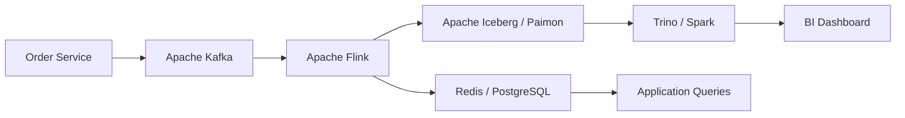
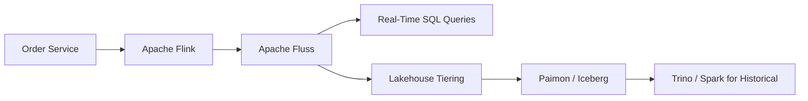
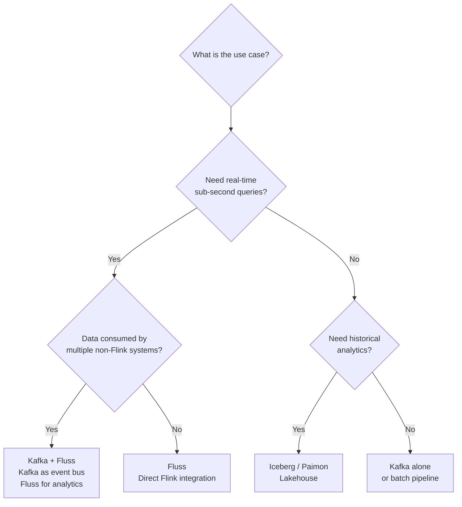

# Fluss vs. Traditional Streaming Architecture

A deep comparison of the traditional Kafka-centric streaming analytics stack against an Apache Fluss-based architecture, in the context of real-time e-commerce order intelligence.

---

## Traditional Architecture

The established pattern for real-time e-commerce analytics chains multiple systems together, each handling a narrow concern.

**Data flow:** Events are produced to Kafka topics, consumed by Flink for enrichment and aggregation, written to a lakehouse table format (Iceberg or Paimon), and then queried by an analytical engine (Trino, Spark) or a BI tool. A separate serving database (Redis, PostgreSQL) is maintained for low-latency point lookups.

### Problems with this approach

| Problem | Description |
|---|---|
| **Freshness delay** | Data must traverse Kafka, Flink, a lakehouse write, and a compaction cycle before becoming queryable. End-to-end latency is typically 1-15 minutes depending on checkpoint intervals and compaction frequency. |
| **Small files problem** | Streaming writes to Iceberg/Paimon produce many small Parquet files. Without aggressive compaction jobs, query performance degrades rapidly. Managing compaction is a production burden. |
| **Large Flink state** | Enrichment joins, windowed aggregations, and deduplication all accumulate state in Flink. State size grows with data volume and key cardinality, increasing checkpoint time and recovery risk. |
| **Kafka is not analytical storage** | Kafka topics are durable logs, not queryable tables. You cannot run ad-hoc SQL queries against Kafka topics without an intermediary. Kafka is optimized for sequential reads, not random lookups. |
| **Separate serving database** | Real-time dashboards need sub-second point lookups. Because Kafka and Iceberg are not designed for this, a separate serving layer (Redis, Elasticsearch, PostgreSQL) must be provisioned, synchronized, and maintained. |
| **Complex debugging** | When metrics look wrong, the investigation spans Kafka consumer lag, Flink job status, checkpoint health, lakehouse file state, compaction status, and serving DB sync. Each system has its own monitoring, logs, and failure modes. |
| **Operational overhead** | Five or more distinct systems require separate expertise, upgrades, capacity planning, and on-call procedures. The total cost of ownership is high even when individual components are open source. |

---

## Fluss-Based Architecture

Apache Fluss consolidates the streaming storage and serving layers into a single system purpose-built for real-time analytics.

**Data flow:** Events enter Flink (via a faker source in this demo, or an application-level producer in production), are enriched and aggregated using Flink SQL, and written to Fluss tables. Fluss serves both streaming subscriptions and low-latency point queries directly. Optionally, Fluss tiers older data to a lakehouse format for long-term retention.

### What this architecture gains

| Benefit | Description |
|---|---|
| **Sub-second freshness** | Data written to Fluss is immediately queryable. There is no compaction cycle or checkpoint delay between write and read. |
| **Unified storage and serving** | Fluss PK (Primary Key) tables support both changelog streaming and key-based lookups. No separate Redis or PostgreSQL needed for serving. |
| **Native Flink integration** | Fluss provides a Flink catalog. Tables defined in Fluss are directly accessible in Flink SQL without connector boilerplate. Temporal lookup joins against Fluss PK tables work natively. |
| **Reduced operational surface** | Fewer systems to deploy, monitor, and upgrade. The data path from ingestion to query is shorter and has fewer failure points. |
| **Built-in lakehouse tiering** | Fluss can tier cold data to Paimon or Iceberg automatically, removing the need for a separate ETL pipeline to populate the lakehouse. |

---

## What Fluss Replaces

### Kafka for analytical workloads

In the traditional stack, Kafka serves as the intermediate buffer between the order service and Flink, and sometimes as the source of truth for replay. For **analytical** use cases -- where the goal is to query aggregated or enriched data -- Fluss replaces Kafka by storing data in a format that is directly queryable.

Fluss Log Tables behave like append-only logs (similar to Kafka topics), but they are integrated with Flink SQL and support direct queries without a separate consumer application.

### Separate serving database

Fluss PK Tables support key-based lookups with low latency. When a dashboard needs the latest enriched order for a specific `order_id`, or the current revenue for a given category window, it can query Fluss directly instead of maintaining a synchronized copy in Redis or PostgreSQL.

---

## What Fluss Does NOT Replace

### Kafka for event bus and microservices

Kafka's core strength is decoupling producers and consumers across organizational and service boundaries. If your order service publishes events consumed by the inventory service, the notification service, the recommendation engine, and the analytics pipeline simultaneously, Kafka remains the right tool. Fluss is not designed as a general-purpose message bus for microservice choreography.

### Complex ETL beyond Flink SQL

Fluss is tightly coupled to the Flink ecosystem. If your ETL pipelines involve Spark, custom Python transformations, or orchestration frameworks like Airflow, those pipelines continue to operate as they do today. Fluss does not replace general-purpose ETL infrastructure.

---

## When to Still Use Kafka

| Scenario | Rationale |
|---|---|
| **Event sourcing** | Kafka's immutable, replayable log with configurable retention is the standard for event sourcing patterns. Kafka guarantees strict ordering per partition and supports exactly-once semantics with transactions. |
| **Cross-system integration** | When events must be consumed by systems outside the Flink/Fluss ecosystem (Elasticsearch, Snowflake, legacy consumers), Kafka's mature connector ecosystem (Kafka Connect, Debezium) is unmatched. |
| **Mature ecosystem needs** | Kafka has 10+ years of production hardening, extensive tooling (Confluent Platform, AKHQ, Conduktor), broad cloud provider support (MSK, Confluent Cloud, Event Hubs), and a large hiring pool of experienced operators. |
| **Multi-datacenter replication** | MirrorMaker 2 and Confluent Replicator provide proven cross-datacenter replication. Fluss does not yet offer equivalent capabilities. |

## When to Still Use Iceberg or Paimon Directly

| Scenario | Rationale |
|---|---|
| **Long-term historical analytics** | Queries spanning months or years of data are better served by columnar formats (Parquet) stored in object storage and queried by Trino or Spark. Fluss is optimized for hot, recent data. |
| **Compliance and archival** | Regulatory requirements (GDPR right-to-audit, financial record retention) often mandate immutable, versioned storage with time-travel capabilities. Iceberg's snapshot isolation and Paimon's changelog support are designed for this. |
| **Cost-optimized cold storage** | Object storage (S3, GCS, HDFS) is an order of magnitude cheaper per TB than hot storage. For data that is rarely queried, a lakehouse format on object storage is the economical choice. |

## When Fluss Is the Right Choice

| Scenario | Rationale |
|---|---|
| **Real-time dashboards** | When the business needs second-level freshness -- live revenue, live order counts, live anomaly feeds -- Fluss delivers queryable data without the latency of a lakehouse write cycle. |
| **Streaming analytics with point lookups** | Dimension enrichment via temporal lookup joins is a core Fluss capability. PK tables serve as both the streaming changelog and the lookup source, eliminating the need for a side database. |
| **Rapid prototyping of streaming pipelines** | Fluss's Flink catalog integration means you can define tables in SQL, stream data in, and query results immediately. The development cycle is significantly shorter than configuring Kafka + Flink + Iceberg + Trino. |
| **Unified real-time and near-real-time queries** | With lakehouse tiering, Fluss supports union reads across hot (Fluss) and cold (Paimon/Iceberg) data, providing a single query interface for both. |

## When Fluss Is Not Necessary

| Scenario | Rationale |
|---|---|
| **Batch-only workloads** | If data is processed in daily or hourly batches and nobody needs real-time visibility, a traditional Spark + Iceberg pipeline is simpler and more cost-effective. |
| **Non-time-sensitive reporting** | Monthly business reviews, quarterly compliance reports, and ad-hoc historical analysis do not benefit from sub-second freshness. A lakehouse alone suffices. |
| **Existing production Kafka infrastructure** | If your Kafka cluster is well-operated, your consumers are stable, and your latency requirements are already met, introducing Fluss adds complexity without clear benefit. |

---

## Feature Comparison

| Feature | Apache Kafka | Apache Fluss | Apache Iceberg / Paimon |
|---|---|---|---|
| **Primary purpose** | Distributed event log / message bus | Real-time streaming storage with SQL queryability | Lakehouse table format for analytical storage |
| **Query support** | No native SQL (requires ksqlDB or consumer apps) | Native Flink SQL via catalog integration | Via Trino, Spark, Flink (batch) |
| **Point lookups** | Not supported | PK Table key-based lookups, sub-second | Not designed for point lookups |
| **Freshness** | Real-time (consumer lag dependent) | Sub-second (write-to-query) | Minutes to hours (depends on compaction) |
| **Table types** | Topics (append-only) | Log Tables (append) + PK Tables (upsert) | Append, merge-on-read, copy-on-write |
| **Flink integration** | Kafka connector (configuration heavy) | Native catalog (zero-config after setup) | Flink-Iceberg / Flink-Paimon connectors |
| **Temporal joins** | Not supported | Native temporal lookup joins on PK tables | Not applicable |
| **Long-term retention** | Expensive at scale (broker storage) | Lakehouse tiering to object storage | Native (object storage, columnar format) |
| **Ecosystem maturity** | Production-grade, 10+ years | Apache Incubating (0.9.0) | Production-grade (Iceberg GA, Paimon growing) |
| **Connector ecosystem** | 200+ Kafka Connect connectors | Flink ecosystem only | Trino, Spark, Flink, Dremio, Snowflake |
| **Multi-tenancy** | Mature (quotas, ACLs, rack awareness) | Early stage | Namespace/catalog level |
| **Cloud managed services** | Confluent Cloud, AWS MSK, Azure Event Hubs | None (self-hosted only) | Tabular, AWS Glue, Snowflake (Iceberg) |

---

## Honest Assessment of Fluss Maturity

Apache Fluss is an **Apache Incubating** project at version **0.9.0-incubating**. This has concrete implications:

- **No production SLA.** The project has not reached its 1.0 release. APIs, configuration properties, and storage formats may change between versions.
- **No managed cloud offering.** You must operate Fluss yourself. There is no equivalent of Confluent Cloud or AWS MSK for Fluss.
- **Limited community size.** The contributor base, StackOverflow presence, and third-party tooling ecosystem are small compared to Kafka or Flink.
- **No proven large-scale production deployments** (publicly documented). Kafka, by contrast, is operated at millions-of-messages-per-second scale at LinkedIn, Uber, Netflix, and hundreds of other organizations.
- **Single-region only.** There is no built-in cross-region replication or disaster recovery mechanism documented for Fluss at this time.

**Recommendation:** Use Fluss for development, prototyping, internal analytics, and non-critical real-time dashboards today. Evaluate production readiness against your specific SLA requirements as the project matures toward 1.0. Do not rip out a working Kafka infrastructure to replace it with Fluss.

---

## Architecture Decision Summary

The three technologies are complementary, not mutually exclusive. A mature production system may well use all three: Kafka for event distribution, Fluss for real-time analytical serving, and Iceberg/Paimon for long-term historical storage. The question is not which one to pick, but where each fits in your data architecture.
