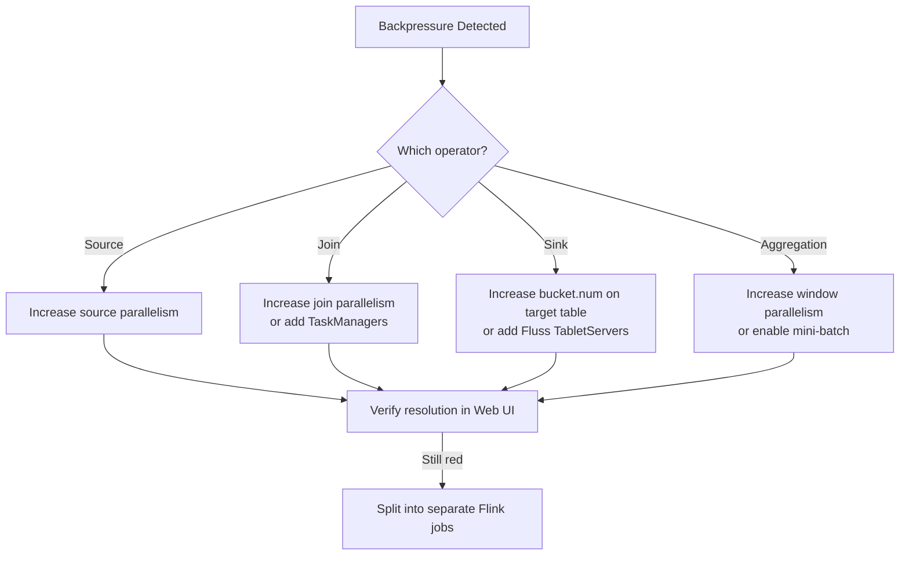
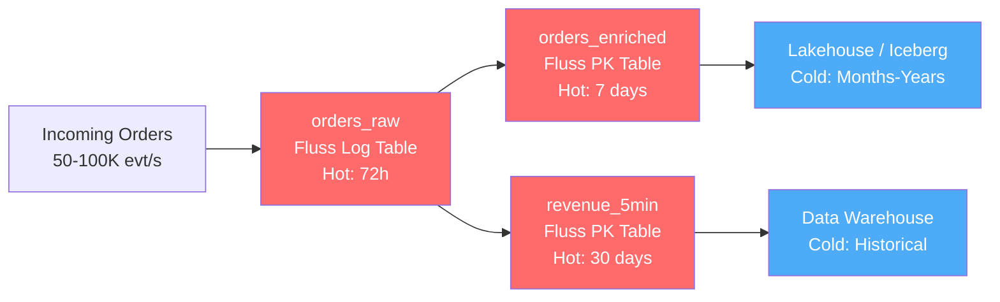
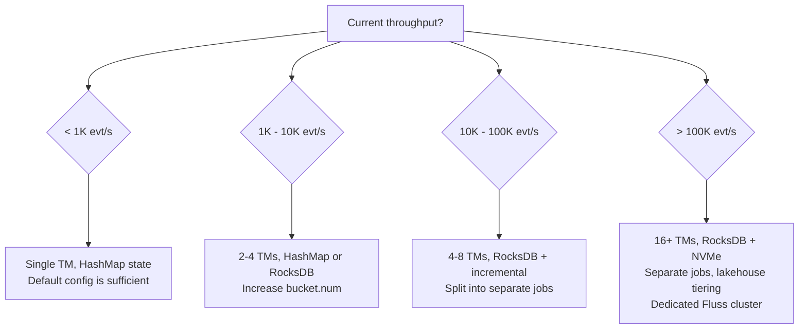

# Large Volume Handling Guide

This guide covers strategies for scaling the Real-Time E-commerce Order Intelligence Platform from development workloads (50 events/sec) to production-grade throughput (100K+ events/sec).

---

## Table of Contents

1. [Local Volume Simulation](#local-volume-simulation)
2. [Partitioning Strategy](#partitioning-strategy)
3. [Parallelism Strategy](#parallelism-strategy)
4. [Backpressure Strategy](#backpressure-strategy)
5. [Checkpointing Strategy](#checkpointing-strategy)
6. [State Management](#state-management)
7. [Retention Strategy](#retention-strategy)
8. [Hot vs Cold Data Separation](#hot-vs-cold-data-separation)
9. [Query Isolation](#query-isolation)
10. [Load Shedding and Rate Limiting](#load-shedding-and-rate-limiting)
11. [Data Quality Guardrails](#data-quality-guardrails)
12. [Scaling Tiers Reference](#scaling-tiers-reference)

---

## Local Volume Simulation

The `04_generate_orders.sql` file uses the `flink-faker` connector with a configurable `rows-per-second` parameter. Adjust this value to simulate different throughput levels locally.

### Development (50 events/sec -- default)

```sql
'rows-per-second' = '50'
```

This is the default configuration. At 50 events/sec the platform processes approximately 3,000 orders/min and 180,000 orders/hour. Suitable for local development on a single Docker Compose stack with 1 TaskManager and 10 task slots.

### Medium Load (500 events/sec)

```sql
'rows-per-second' = '500'
```

At 500 events/sec the platform ingests roughly 30,000 orders/min. This exercises checkpoint pressure and window aggregation under moderate load. Ensure the TaskManager has at least 2 GB of process memory (`taskmanager.memory.process.size: 2048m` as configured in `docker-compose.yml`).

### High Load (5,000 events/sec)

```sql
'rows-per-second' = '5000'
```

At 5,000 events/sec (300K orders/min), expect significant resource consumption. For local testing at this rate:

- Scale TaskManagers: `docker compose up --scale taskmanager=3`
- Increase task slots per TaskManager to 10 (already configured)
- Monitor backpressure via the Flink Web UI at `http://localhost:8083`
- Watch for `OutOfMemoryError` and increase `taskmanager.memory.process.size` if needed

### Verifying Throughput

Use the Flink Web UI to confirm actual ingestion rate:

1. Navigate to `http://localhost:8083`
2. Open the running job graph
3. Check the `numRecordsInPerSecond` metric on the `orders_raw` sink operator
4. Compare against the configured `rows-per-second`

---

## Partitioning Strategy

Apache Fluss distributes data across **buckets**, which are the unit of parallelism and storage. The `bucket.num` property on each table controls how many partitions the data is split into.

### Current Configuration

| Table              | bucket.num | Rationale                                      |
|--------------------|:----------:|-------------------------------------------------|
| orders_raw         | 4          | Moderate write fan-out for append-only ingestion |
| customer_profile   | 4          | Small dimension table, low update rate           |
| product_catalog    | 4          | Small dimension table, 30 products               |
| orders_enriched    | 8          | High write throughput from enrichment join        |
| revenue_5min       | 4          | Bounded cardinality (categories x windows)       |
| city_revenue_5min  | 4          | Bounded cardinality (8 cities x windows)         |
| high_value_orders  | 4          | Sparse writes (~25% of orders)                   |
| suspicious_orders  | 4          | Very sparse writes                               |

### Sizing Guidelines

```
bucket.num >= max_write_parallelism
bucket.num <= 2 x number_of_tablet_servers (for even distribution)
```

When scaling to production:

| Throughput Tier | orders_raw | orders_enriched | Aggregate Tables |
|:---------------:|:----------:|:---------------:|:----------------:|
| 1K events/sec   | 8          | 16              | 4                |
| 10K events/sec  | 32         | 64              | 8                |
| 100K events/sec | 128        | 256             | 16               |

Over-partitioning wastes resources on metadata and small files. Under-partitioning creates hot buckets and write contention. A good rule of thumb: each bucket should handle 500-2,000 events/sec of sustained write throughput.

---

## Parallelism Strategy

Flink parallelism determines how many subtask instances process data concurrently. The current setup uses 10 task slots per TaskManager.

### Parallelism Rules

1. **Source parallelism** should match `bucket.num` of the source table (or be a factor of it).
2. **Sink parallelism** should match `bucket.num` of the target table.
3. **Join parallelism** should match the parallelism of the larger side of the join.
4. **Aggregation parallelism** can be lower since aggregates reduce cardinality.

### Scaling TaskManagers

```bash
# Scale to N TaskManagers locally
docker compose up --scale taskmanager=N -d
```

Total available slots = `N x taskmanager.numberOfTaskSlots`.

### Production Parallelism Planning

| Throughput Tier | TaskManagers | Slots/TM | Total Slots | Source Parallelism | Join Parallelism |
|:---------------:|:------------:|:--------:|:-----------:|:------------------:|:----------------:|
| 1K events/sec   | 2            | 8        | 16          | 8                  | 16               |
| 10K events/sec  | 6            | 8        | 48          | 32                 | 64               |
| 100K events/sec | 16           | 8        | 128         | 128                | 256              |

At 100K events/sec, run enrichment joins and window aggregations as separate Flink jobs to allow independent scaling.

---

## Backpressure Strategy

Backpressure occurs when a downstream operator cannot keep up with upstream throughput. In this platform, the most common bottleneck is the enrichment join (`orders_raw` JOIN `customer_profile` JOIN `product_catalog`).

### Detection

Monitor backpressure through the Flink Web UI:

- **Green**: healthy, no backpressure
- **Yellow**: some backpressure, operator occasionally stalls
- **Red**: sustained backpressure, immediate action required

### Mitigation Hierarchy



### Proactive Measures

- Set `taskmanager.memory.framework.off-heap.size: 256m` (already configured) to prevent off-heap contention during shuffles.
- Use async I/O for lookup joins when dimension tables grow beyond memory.
- Configure network buffer size: `taskmanager.network.memory.fraction: 0.15` for high-throughput scenarios.

---

## Checkpointing Strategy

Checkpointing enables exactly-once state consistency and failure recovery. The current configuration:

```yaml
execution.checkpointing.interval: 30s
execution.checkpointing.min-pause: 10s
state.checkpoints.dir: file:///tmp/flink-checkpoints
```

### Tuning by Throughput Tier

| Parameter                             | 50 evt/s (dev) | 1K evt/s     | 10K evt/s    | 100K evt/s   |
|---------------------------------------|:--------------:|:------------:|:------------:|:------------:|
| `execution.checkpointing.interval`    | 30s            | 30s          | 60s          | 120s         |
| `execution.checkpointing.min-pause`   | 10s            | 15s          | 30s          | 60s          |
| `execution.checkpointing.timeout`     | 10min (default)| 5min         | 5min         | 10min        |
| `state.checkpoints.num-retained`      | 1              | 2            | 3            | 5            |

### Key Principles

- **Interval**: Shorter intervals mean faster recovery but more overhead. At high throughput, checkpoint overhead becomes significant -- increase the interval.
- **Min-pause**: Prevents checkpoint storms. Should be at least 1/3 of the interval.
- **Timeout**: If a checkpoint takes longer than this, it is aborted. Set this higher than your longest observed checkpoint duration.
- **Retained checkpoints**: Keep at least 2 in production so you can fall back if the latest checkpoint is corrupted.

### Production Storage

Replace the local file path with a distributed filesystem:

```yaml
state.checkpoints.dir: s3://your-bucket/flink-checkpoints/
state.savepoints.dir: s3://your-bucket/flink-savepoints/
```

---

## State Management

Flink maintains state for keyed operations (joins, aggregations, deduplication). As throughput grows, state size grows proportionally.

### State Backend Selection

| Backend   | Best For                     | Characteristics                              |
|-----------|------------------------------|----------------------------------------------|
| HashMapStateBackend | Small state (< 1 GB)  | Fast, in-JVM-heap, limited by memory         |
| RocksDB   | Large state (1 GB - 1 TB+)   | Disk-backed, incremental checkpoints, slower per-access |

For production at 10K+ events/sec, switch to RocksDB:

```yaml
state.backend: rocksdb
state.backend.rocksdb.localdir: /tmp/rocksdb-state
state.backend.incremental: true
```

### State TTL (Time-To-Live)

Configure TTL to prevent unbounded state growth, especially for the enrichment join:

```sql
SET 'table.exec.state.ttl' = '86400000';  -- 24 hours in milliseconds
```

TTL guidance by table type:

| Operation              | Recommended TTL | Rationale                                    |
|------------------------|:---------------:|----------------------------------------------|
| Enrichment join state  | 24 hours        | Orders older than 24h are unlikely to arrive |
| Window aggregation     | 2x window size  | 10 minutes for a 5-minute window             |
| Deduplication          | 1 hour          | Covers realistic duplicate delivery window   |

### State Size Estimation

```
State size (MB) ≈ (events/sec) x (state TTL in sec) x (avg record size in bytes) / 1,000,000
```

Example at 10K events/sec with 24h TTL and 200 bytes/record:

```
10,000 x 86,400 x 200 / 1,000,000 = 172,800 MB ≈ 169 GB
```

This demands RocksDB with fast SSDs and incremental checkpointing.

---

## Retention Strategy

Retention policies control how long data is stored in Fluss tables before it is discarded or tiered to cold storage.

### Log Table Retention

Log tables (`orders_raw`, `high_value_orders`, `suspicious_orders`) grow unboundedly by default. Configure segment-based retention:

```
log.retention.time = 72h       -- Keep 3 days of raw logs
log.segment.bytes = 134217728  -- 128 MB segments
```

### PK Table Retention

PK tables (`customer_profile`, `product_catalog`, `orders_enriched`) maintain only the latest state per key. Their size is bounded by the number of unique keys, not by event volume. However, `orders_enriched` grows with every unique `order_id` -- apply compaction and archival policies for production.

### Retention Recommendations by Table

| Table              | Type | Hot Retention | Archive Strategy               |
|--------------------|------|:-------------:|--------------------------------|
| orders_raw         | Log  | 72 hours      | Tier to lakehouse after 72h    |
| customer_profile   | PK   | Indefinite    | Small table, no archival needed|
| product_catalog    | PK   | Indefinite    | Small table, no archival needed|
| orders_enriched    | PK   | 7 days        | Tier to lakehouse after 7d     |
| revenue_5min       | PK   | 30 days       | Export to data warehouse monthly|
| city_revenue_5min  | PK   | 30 days       | Export to data warehouse monthly|
| high_value_orders  | Log  | 30 days       | Archive to object storage      |
| suspicious_orders  | Log  | 90 days       | Compliance retention in cold store |

---

## Hot vs Cold Data Separation

Separating frequently queried "hot" data from historical "cold" data is essential for cost and performance at scale.



### Hot Tier (Fluss)

- Served directly from Fluss TabletServers
- Sub-second read latency for PK lookups
- Backed by local SSD or tmpfs (as in the current Docker setup)
- Retention: hours to days

### Cold Tier (Lakehouse / Object Storage)

- Fluss supports lakehouse tiering (e.g., Apache Paimon, Apache Iceberg)
- Cold data lives on S3/GCS/Azure Blob
- Query via Flink batch jobs or a query engine like Trino
- Retention: months to years

### Tiering Configuration (Future)

```
remote.data.dir: s3://your-bucket/fluss/remote-data
```

The current `docker-compose.yml` uses `/tmp/fluss/remote-data` as a placeholder. In production, point this to object storage for lakehouse tiering.

---

## Query Isolation

Dashboard queries should never scan raw event tables directly. The platform architecture pre-computes aggregate tables specifically for this purpose.

### Correct Query Patterns

| Use Case                  | Query Target       | Why                                     |
|---------------------------|--------------------|-----------------------------------------|
| Revenue dashboard         | `revenue_5min`     | Pre-aggregated, bounded result set      |
| City-level monitoring     | `city_revenue_5min`| Pre-aggregated by city                  |
| High-value order alerts   | `high_value_orders`| Pre-filtered, only threshold-exceeding  |
| Fraud monitoring          | `suspicious_orders`| Pre-classified with reason codes        |
| Single order lookup       | `orders_enriched`  | PK lookup by order_id, O(1) latency     |
| Customer profile          | `customer_profile` | PK lookup by customer_id                |

### Anti-Patterns to Avoid

- **Never** run `SELECT * FROM orders_raw` for dashboard queries. This forces a full scan of the append-only log.
- **Never** run ad-hoc aggregations on `orders_enriched` for dashboards. Use the pre-computed `revenue_5min` or `city_revenue_5min` tables.
- **Always** add `WHERE` filters on time columns when querying log tables.
- **Always** add `LIMIT` to exploratory queries against log tables.

---

## Load Shedding and Rate Limiting

When the platform approaches capacity, controlled degradation is preferable to cascading failure.

### Source-Side Rate Limiting

The `rows-per-second` parameter on the `flink-faker` source acts as a natural rate limiter. In production with a real message queue (e.g., Kafka), configure consumer-side throttling:

```
# Kafka consumer rate limiting example
fetch.max.bytes = 52428800          # 50 MB per fetch
max.partition.fetch.bytes = 1048576 # 1 MB per partition per fetch
```

### Flink-Side Load Shedding

1. **Drop late events aggressively**: Tighten the watermark delay from 5 seconds to 2 seconds during overload.
2. **Increase window size**: Switch from 5-minute to 15-minute windows to reduce aggregation frequency.
3. **Disable non-critical pipelines**: Stop the `suspicious_orders` and `high_value_orders` jobs during extreme load to free slots for core enrichment.

### Circuit Breaker Pattern

Monitor the following metrics and trigger alerts:

| Metric                       | Warning Threshold | Critical Threshold | Action                     |
|------------------------------|:-----------------:|:------------------:|----------------------------|
| Input records/sec vs capacity| > 70%             | > 90%              | Scale TaskManagers         |
| Checkpoint duration          | > 50% of interval | > 80% of interval  | Increase interval or scale |
| Consumer lag (seconds)       | > 30s             | > 120s             | Shed non-critical jobs     |
| GC pause time                | > 500ms           | > 2s               | Increase heap or switch to RocksDB |

---

## Data Quality Guardrails

As volume increases, data quality issues become more impactful and harder to detect.

### Schema Validation

All tables enforce schema at the Fluss catalog level. Invalid records that do not conform to the table schema are rejected at write time.

### Semantic Validation Rules

Apply these in the enrichment pipeline before writing to `orders_enriched`:

| Rule                           | Check                                    | Action on Failure        |
|--------------------------------|------------------------------------------|--------------------------|
| Non-negative amount            | `order_amount > 0`                       | Drop or route to DLQ     |
| Valid quantity                  | `quantity BETWEEN 1 AND 100`             | Clamp to valid range     |
| Known customer                 | `customer_id IN customer_profile`        | Use "UNKNOWN" placeholder|
| Known product                  | `product_id IN product_catalog`          | Use "UNKNOWN" placeholder|
| Reasonable event time          | `event_time > NOW() - INTERVAL '1' DAY` | Drop stale events        |
| Valid payment status           | `payment_status IN ('SUCCESS','FAILED','PENDING')` | Drop      |

### Monitoring Data Quality

Track these metrics over time:

- **Join miss rate**: percentage of orders where the customer or product lookup returned null (indicates stale dimension data).
- **Late event rate**: percentage of events arriving after the watermark (dropped by window aggregations).
- **Schema rejection rate**: events rejected at the Fluss sink.

---

## Scaling Tiers Reference

A comprehensive reference for all configuration parameters across throughput tiers.

### 1K Events/Sec

Expected volume: 60K orders/min, 3.6M orders/hour.

```yaml
# Flink
taskmanager.numberOfTaskSlots: 8
execution.checkpointing.interval: 30s
execution.checkpointing.min-pause: 15s
state.backend: hashmap
table.exec.state.ttl: 86400000   # 24h

# Fluss bucket.num
orders_raw: 8
orders_enriched: 16
revenue_5min: 4
city_revenue_5min: 4

# Infrastructure
TaskManagers: 2
TabletServers: 2
Memory per TM: 4 GB
```

### 10K Events/Sec

Expected volume: 600K orders/min, 36M orders/hour.

```yaml
# Flink
taskmanager.numberOfTaskSlots: 8
execution.checkpointing.interval: 60s
execution.checkpointing.min-pause: 30s
state.backend: rocksdb
state.backend.incremental: true
table.exec.state.ttl: 86400000   # 24h

# Fluss bucket.num
orders_raw: 32
orders_enriched: 64
revenue_5min: 8
city_revenue_5min: 8

# Infrastructure
TaskManagers: 6
TabletServers: 4
Memory per TM: 8 GB
Disk: SSD required for RocksDB state
```

### 100K Events/Sec

Expected volume: 6M orders/min, 360M orders/hour.

```yaml
# Flink
taskmanager.numberOfTaskSlots: 8
execution.checkpointing.interval: 120s
execution.checkpointing.min-pause: 60s
state.backend: rocksdb
state.backend.incremental: true
state.backend.rocksdb.localdir: /mnt/ssd/rocksdb
table.exec.state.ttl: 43200000   # 12h (reduced to manage state size)

# Fluss bucket.num
orders_raw: 128
orders_enriched: 256
revenue_5min: 16
city_revenue_5min: 16

# Infrastructure
TaskManagers: 16
TabletServers: 8
Memory per TM: 16 GB
Disk: NVMe SSD required
Network: 10 Gbps minimum

# Separate Flink jobs
Job 1: orders_raw -> orders_enriched (enrichment)
Job 2: orders_enriched -> revenue_5min + city_revenue_5min (aggregation)
Job 3: orders_enriched -> high_value_orders + suspicious_orders (alerts)
```

### Scaling Decision Flowchart


