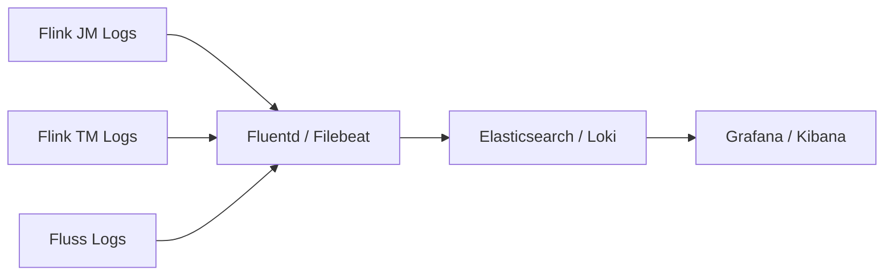

# Observability Guide

This document defines the monitoring, logging, alerting, and SLO framework for the Real-Time E-commerce Order Intelligence Platform.

---

## Table of Contents

1. [Key Metrics](#key-metrics)
2. [Logging Strategy](#logging-strategy)
3. [Alert Rules](#alert-rules)
4. [Dashboard Ideas](#dashboard-ideas)
5. [Service Level Objectives (SLOs)](#service-level-objectives-slos)

---

## Key Metrics

### Flink Job Metrics

These metrics are exposed via the Flink Metrics system and accessible through the REST API at `http://localhost:8083/jobs/<job-id>/metrics`.

| Metric | Source | What It Tells You |
|---|---|---|
| `numRecordsInPerSecond` | Source operator | Actual ingestion rate. Compare against configured `rows-per-second`. |
| `numRecordsOutPerSecond` | Sink operator | Output throughput to Fluss tables. |
| `isBackPressured` | Per operator | Whether the operator is stalling due to downstream slowness. |
| `busyTimeMsPerSecond` | Per subtask | CPU utilization per subtask. Values near 1000ms/s indicate saturation. |
| `lastCheckpointDuration` | JobManager | Time taken to complete the most recent checkpoint. Spikes indicate state growth or storage issues. |
| `lastCheckpointSize` | JobManager | Bytes written in the last checkpoint. Track growth over time. |
| `numberOfFailedCheckpoints` | JobManager | Cumulative count of failed checkpoints. Must be zero in steady state. |
| `numberOfCompletedCheckpoints` | JobManager | Cumulative successful checkpoints. Should increment every `checkpointing.interval`. |
| `currentInputWatermark` | Window operator | The current watermark. `NOW() - watermark` is the processing delay. |
| `numLateRecordsDropped` | Window operator | Records that arrived after the watermark and were dropped. |
| `fullRestarts` | JobManager | Total number of job restarts. Non-zero indicates failures. |

### Fluss Storage Metrics

| Metric | What It Tells You |
|---|---|
| Write latency (p50, p95, p99) | Time to write a record to a Fluss TabletServer. High latency indicates disk or network saturation. |
| Read latency (p50, p95, p99) | Time to serve a point lookup or scan from a TabletServer. |
| Consumer lag (records) | Difference between the latest written offset and the consumer's current offset. Indicates how far behind a Flink job is. |
| Bucket count per TabletServer | Data distribution balance. Uneven distribution causes hot spots. |
| Segment count and size | Storage growth rate. Helps plan retention and tiering. |

### Application-Level Metrics

Derived from the platform's own tables and queries.

| Metric | Derivation | What It Tells You |
|---|---|---|
| Input events/sec | `COUNT(*)` from `orders_raw` over a 1-minute tumbling window | Actual order ingestion throughput. |
| Failed payment rate | `failed_payments / total_orders` from `revenue_5min` | Business health indicator. Normal range: 10-20%. |
| High-value order rate | `COUNT(*)` from `high_value_orders` per minute | Proportion of high-value transactions. |
| Suspicious order rate | `COUNT(*)` from `suspicious_orders` per minute | Fraud signal intensity. Spikes require investigation. |
| Window completion delay | `MAX(processing_time - window_end)` | How long after a window closes until results appear in the aggregate table. |
| Consumer lag (seconds) | `NOW() - MAX(event_time)` from sink table | End-to-end latency from event generation to table availability. |

---

## Logging Strategy

### Log Levels by Component

| Component | Recommended Level | Notes |
|---|---|---|
| Flink JobManager | INFO | Captures job lifecycle, checkpoint events, restarts |
| Flink TaskManager | INFO | Captures operator lifecycle, errors, warnings |
| Fluss CoordinatorServer | INFO | Captures table creation, metadata changes |
| Fluss TabletServer | WARN | High-volume component; INFO generates excessive output |
| SQL Client | DEBUG | Development only; captures submitted SQL and results |

### Structured Log Fields

For production, configure Flink to output JSON-structured logs with the following fields:

```json
{
  "timestamp": "2025-05-02T14:30:00.123Z",
  "level": "WARN",
  "logger": "org.apache.flink.runtime.checkpoint.CheckpointCoordinator",
  "message": "Checkpoint 42 expired before completing",
  "job_id": "abc123",
  "checkpoint_id": 42,
  "container": "taskmanager-0"
}
```

Configure in `log4j2.properties`:

```properties
appender.console.layout.type = JsonLayout
appender.console.layout.compact = true
appender.console.layout.eventEol = true
```

### Log Aggregation

In production, ship logs from all containers to a centralized system:



### Key Log Patterns to Monitor

| Pattern | Severity | Indicates |
|---|---|---|
| `Checkpoint .* expired before completing` | Warning | Checkpoint is taking too long; consider increasing timeout |
| `Restoring .* from checkpoint` | Info | Job is recovering from a failure |
| `Connection refused` or `Connection reset` | Error | Network partition or service down |
| `OutOfMemoryError` | Critical | Memory exhaustion; increase heap or switch to RocksDB |
| `Exceeded checkpoint tolerable failure threshold` | Critical | Multiple consecutive checkpoint failures |
| `WARN .* Dropping late event` | Warning | Events arriving after watermark deadline |

---

## Alert Rules

### Critical Alerts (Page On-Call)

| Alert Name | Condition | Duration | Action |
|---|---|---|---|
| Job Failed | Job state = `FAILED` | Immediate | Investigate root cause, restart from checkpoint |
| Checkpoint Failure Streak | `numberOfFailedCheckpoints` increased by >= 3 in 5 min | 5 min | Check state size, storage availability, network |
| Consumer Lag Critical | Lag > 120 seconds | 5 min | Scale TaskManagers, check for backpressure |
| TabletServer Down | Health check fails | 2 min | Check Fluss logs, restart container if needed |
| OOM Kill | Container exit code 137 | Immediate | Increase memory limits, investigate memory leak |

### Warning Alerts (Notify Channel)

| Alert Name | Condition | Duration | Action |
|---|---|---|---|
| Backpressure Detected | Any operator `isBackPressured = true` | 3 min | Identify bottleneck operator, consider scaling |
| Checkpoint Duration High | `lastCheckpointDuration` > 50% of interval | 3 consecutive | Plan for state backend upgrade or interval increase |
| Consumer Lag Elevated | Lag > 30 seconds | 5 min | Monitor trend; may self-resolve after burst |
| High Failed Payment Rate | `failed_payments / total_orders` > 25% | 10 min | Notify payments team |
| Suspicious Order Spike | `suspicious_orders` rate > 3x baseline | 5 min | Notify fraud team |
| Late Events Increasing | `numLateRecordsDropped` rate > 100/min | 5 min | Consider increasing watermark delay |

### Alert Rule Examples (Prometheus/Alertmanager Format)

```yaml
groups:
  - name: flink_platform_alerts
    rules:
      - alert: FlinkJobFailed
        expr: flink_jobmanager_job_state{state="FAILED"} == 1
        for: 0m
        labels:
          severity: critical
        annotations:
          summary: "Flink job {{ $labels.job_name }} has failed"
          description: "Job entered FAILED state. Check Flink Web UI for details."

      - alert: CheckpointFailureStreak
        expr: increase(flink_jobmanager_job_numberOfFailedCheckpoints[5m]) >= 3
        for: 0m
        labels:
          severity: critical
        annotations:
          summary: "3+ checkpoint failures in 5 minutes for {{ $labels.job_name }}"

      - alert: ConsumerLagCritical
        expr: flink_source_consumer_lag_seconds > 120
        for: 5m
        labels:
          severity: critical
        annotations:
          summary: "Consumer lag exceeds 120 seconds for {{ $labels.job_name }}"

      - alert: BackpressureDetected
        expr: flink_taskmanager_job_task_isBackPressured == 1
        for: 3m
        labels:
          severity: warning
        annotations:
          summary: "Backpressure on {{ $labels.task_name }} in {{ $labels.job_name }}"

      - alert: HighFailedPaymentRate
        expr: sum(revenue_5min_failed_payments) / sum(revenue_5min_total_orders) > 0.25
        for: 10m
        labels:
          severity: warning
        annotations:
          summary: "Failed payment rate exceeds 25%"
```

---

## Dashboard Ideas

### Grafana Dashboard Layout

The following Grafana dashboards provide a comprehensive view of platform health.

#### Dashboard 1: Pipeline Overview

A single-pane view of the entire streaming pipeline.

| Panel | Type | Data Source | Query |
|---|---|---|---|
| Ingestion Rate | Time series | Flink Metrics | `numRecordsInPerSecond` on source operator |
| Output Rate | Time series | Flink Metrics | `numRecordsOutPerSecond` per sink |
| Pipeline Lag | Gauge | Flink Metrics | `NOW() - currentInputWatermark` |
| Job Status | Stat | Flink REST API | Job state per job |
| Active Jobs | Table | Flink REST API | Job name, state, uptime, restarts |

```
+-------------------------------------------+
|           Pipeline Overview               |
+-------------------+-----------------------+
| Ingestion Rate    | Output Rate           |
| [time series]     | [time series]         |
+-------------------+-----------------------+
| Pipeline Lag      | Job Status            |
| [gauge: 2.3s]     | [stat: 4 RUNNING]     |
+-------------------+-----------------------+
|              Active Jobs                  |
| [table: name, state, uptime, restarts]    |
+-------------------------------------------+
```

#### Dashboard 2: Checkpoint Health

| Panel | Type | Data Source | Query |
|---|---|---|---|
| Checkpoint Duration | Time series | Flink Metrics | `lastCheckpointDuration` per job |
| Checkpoint Size | Time series | Flink Metrics | `lastCheckpointSize` per job |
| Failed Checkpoints | Counter | Flink Metrics | `numberOfFailedCheckpoints` |
| Checkpoint Timeline | Heatmap | Flink Metrics | Checkpoint start/end times |

#### Dashboard 3: Business Metrics

| Panel | Type | Data Source | Query |
|---|---|---|---|
| Revenue per Category (5min) | Stacked bar | `revenue_5min` table | `total_revenue` grouped by `category` |
| Top Cities by Revenue | Horizontal bar | `city_revenue_5min` table | `total_revenue` grouped by `city` |
| Failed Payment Rate | Time series | `revenue_5min` table | `failed_payments / total_orders` |
| High-Value Order Count | Counter | `high_value_orders` table | `COUNT(*)` per 5 min |
| Suspicious Order Count | Counter | `suspicious_orders` table | `COUNT(*)` per 5 min |
| Average Order Value | Time series | `revenue_5min` table | `avg_order_value` per category |

```
+-------------------------------------------+
|          Business Intelligence            |
+-------------------+-----------------------+
| Revenue/Category  | Top Cities by Revenue |
| [stacked bar]     | [horizontal bar]      |
+-------------------+-----------------------+
| Failed Payment %  | Avg Order Value       |
| [time series]     | [time series]         |
+-------------------+-----------------------+
| High-Value Orders | Suspicious Orders     |
| [counter: 142]    | [counter: 7]          |
+-------------------------------------------+
```

#### Dashboard 4: Infrastructure

| Panel | Type | Data Source | Query |
|---|---|---|---|
| TaskManager CPU | Time series | Container metrics | CPU usage per TM |
| TaskManager Memory | Time series | Container metrics | Heap + off-heap per TM |
| Task Slots Usage | Gauge | Flink REST API | Used / total slots |
| Fluss Write Latency | Histogram | Fluss Metrics | p50, p95, p99 write latency |
| Fluss Read Latency | Histogram | Fluss Metrics | p50, p95, p99 read latency |
| Disk Usage | Time series | Host metrics | Disk used by Fluss data dir |

### Connecting Grafana to Flink Metrics

Flink supports Prometheus as a metrics reporter. Add to Flink configuration:

```yaml
metrics.reporter.promgateway.factory.class: org.apache.flink.metrics.prometheus.PrometheusReporterFactory
metrics.reporter.promgateway.port: 9249
```

Then configure Prometheus to scrape the Flink metrics endpoint and add Prometheus as a data source in Grafana.

---

## Service Level Objectives (SLOs)

SLOs define the reliability targets for the platform. These should be reviewed quarterly and adjusted based on observed performance.

### SLO Table

| SLO | Target | Measurement | Rationale |
|---|---|---|---|
| **Ingestion latency (p95)** | < 5 seconds | Time from event generation to appearance in `orders_raw` | Events must be available for enrichment within seconds. The 5-second watermark delay already accounts for this budget. |
| **Failed checkpoint count** | 0 | `numberOfFailedCheckpoints` over a 1-hour rolling window | Any failed checkpoint indicates a risk to data consistency and recovery capability. |
| **Dashboard query latency** | < 3 seconds | Time to execute a `SELECT` against `revenue_5min` or `city_revenue_5min` | Dashboard users expect near-instant response. Pre-aggregated tables with bounded cardinality should serve results in under 3 seconds. |
| **Event processing lag** | < 60 seconds | `NOW() - MAX(event_time)` in `orders_enriched` | Enriched data should be no more than 60 seconds behind real-time. This SLO covers the full enrichment pipeline latency. |
| **Data freshness (hot tables)** | < 10 seconds | `NOW() - MAX(event_time)` in `revenue_5min` and `city_revenue_5min` | Aggregate tables feeding dashboards should reflect events from no more than 10 seconds ago. |

### SLO Burn Rate Alerts

Use burn rate alerting to detect SLO violations before they exhaust the error budget.

| SLO | Error Budget (30-day) | Fast Burn Alert (1h window) | Slow Burn Alert (6h window) |
|---|---|---|---|
| Ingestion latency p95 < 5s | 0.1% of events > 5s | > 2% of events > 5s | > 0.5% of events > 5s |
| Failed checkpoints = 0 | 0 failures per hour | Any failure | N/A |
| Dashboard query < 3s | 0.5% of queries > 3s | > 5% of queries > 3s | > 2% of queries > 3s |
| Processing lag < 60s | 1% of time > 60s | > 10% of time > 60s | > 5% of time > 60s |
| Data freshness < 10s | 1% of time > 10s | > 10% of time > 10s | > 5% of time > 10s |

### Measurement Implementation

To measure these SLOs, implement the following:

1. **Ingestion latency**: Compare `event_time` with the wall clock time when the record appears in `orders_raw`. This requires a metadata column or a Flink metric.

2. **Failed checkpoints**: Scrape `numberOfFailedCheckpoints` from the Flink REST API every 30 seconds. Alert on any increase.

3. **Dashboard query latency**: Instrument the dashboard application to record query execution time. If using Grafana, the built-in query inspector provides this.

4. **Processing lag**: Run a periodic query:
   ```sql
   SELECT TIMESTAMPDIFF(SECOND, MAX(event_time), CURRENT_TIMESTAMP) AS lag_seconds
   FROM orders_enriched;
   ```

5. **Data freshness**: Same approach for aggregate tables:
   ```sql
   SELECT TIMESTAMPDIFF(SECOND, MAX(window_end), CURRENT_TIMESTAMP) AS freshness_seconds
   FROM revenue_5min;
   ```

### SLO Review Cadence

| Activity | Frequency |
|---|---|
| SLO metric collection | Continuous (every 30 seconds) |
| SLO dashboard review | Daily (part of on-call handoff) |
| Error budget review | Weekly (engineering standup) |
| SLO target adjustment | Quarterly (architecture review) |
