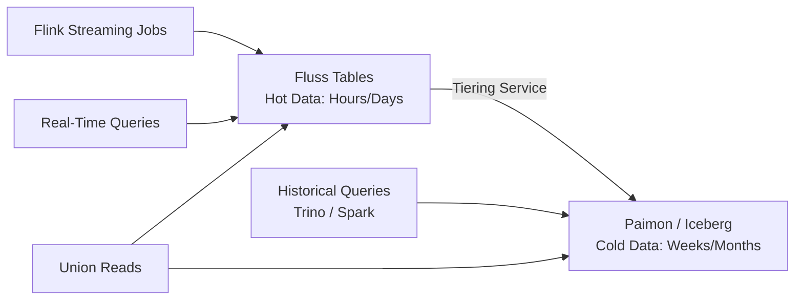
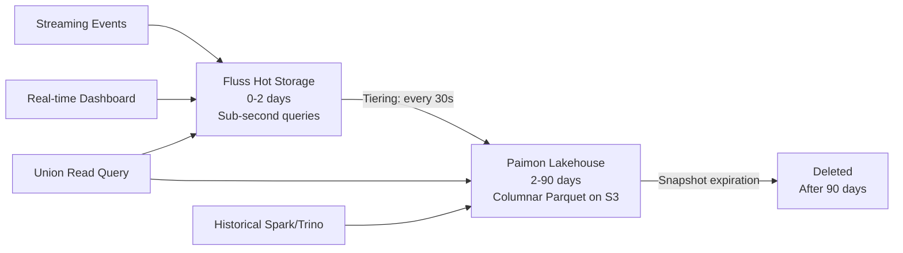

# Phase 2: Lakehouse Tiering

Implementation plan for adding lakehouse tiering to the Real-Time E-commerce Order Intelligence Platform. This extends the current Fluss-only deployment with automatic data lifecycle management, tiering recent data from Fluss to a Paimon or Iceberg lakehouse for long-term retention and historical analytics.

---

## Overview

Fluss lakehouse tiering automatically moves data from Fluss's hot storage to a lakehouse table format on object-compatible storage. Recent data (hours to days) remains in Fluss for sub-second queries, while historical data (weeks to months) is compacted and stored as Parquet files in Paimon or Iceberg format.



**Key capability:** Union reads allow a single query to transparently access both hot data in Fluss and cold data in the lakehouse, providing a unified view across the entire data lifecycle.

---

## Prerequisites

- The current Phase 1 deployment is running (Fluss + Flink + all streaming jobs).
- Familiarity with the existing table schema defined in `sql/02_create_tables.sql`.
- Docker Compose environment with sufficient resources (8GB+ RAM recommended with tiering enabled).

---

## Step 1: Add Object-Compatible Storage

Lakehouse tiering writes Parquet files to an object storage backend. For local development, use either RustFS (lightweight, S3-compatible) or MinIO (more features, heavier).

### Option A: RustFS (Recommended for Local Development)

RustFS is a minimal S3-compatible object store, well-suited for local testing.

Add to `docker-compose.yml`:

```yaml
  rustfs:
    image: rustfs/rustfs:latest
    command: server /data --console-address ":9001"
    ports:
      - "9000:9000"
      - "9001:9001"
    environment:
      RUSTFS_ROOT_USER: admin
      RUSTFS_ROOT_PASSWORD: password
    volumes:
      - rustfs-data:/data
    healthcheck:
      test: ["CMD-SHELL", "curl -f http://localhost:9000/minio/health/live || exit 1"]
      interval: 10s
      timeout: 5s
      retries: 5
```

Add to `volumes`:

```yaml
volumes:
  shared-tmpfs:
    driver: local
    driver_opts:
      type: "tmpfs"
      device: "tmpfs"
  rustfs-data:
```

### Option B: MinIO

If you need a more feature-complete S3 implementation (versioning, lifecycle policies, web console):

```yaml
  minio:
    image: minio/minio:latest
    command: server /data --console-address ":9001"
    ports:
      - "9000:9000"
      - "9001:9001"
    environment:
      MINIO_ROOT_USER: admin
      MINIO_ROOT_PASSWORD: password
    volumes:
      - minio-data:/data
    healthcheck:
      test: ["CMD-SHELL", "curl -f http://localhost:9000/minio/health/live || exit 1"]
      interval: 10s
      timeout: 5s
      retries: 5
```

### Create the Lakehouse Bucket

After the storage service starts, create a bucket for lakehouse data:

```bash
# Using the MinIO client (works with both RustFS and MinIO)
docker run --rm --network host \
  minio/mc alias set local http://localhost:9000 admin password

docker run --rm --network host \
  minio/mc mb local/fluss-lakehouse
```

---

## Step 2: Configure Fluss for Lakehouse Tiering

Update the Fluss CoordinatorServer and TabletServer configurations to enable lakehouse tiering.

### CoordinatorServer Configuration

Update the `coordinator-server` environment in `docker-compose.yml`:

```yaml
  coordinator-server:
    image: apache/fluss:0.9.0-incubating
    command: coordinatorServer
    depends_on:
      zookeeper:
        condition: service_healthy
      rustfs:
        condition: service_healthy
    ports:
      - "9123:9123"
    environment:
      - |
        FLUSS_PROPERTIES=
        zookeeper.address: zookeeper:2181
        bind.listeners: FLUSS://coordinator-server:9123
        remote.data.dir: s3://fluss-lakehouse/remote-data
        datalake.format: paimon
        datalake.paimon.metastore: filesystem
        datalake.paimon.warehouse: s3://fluss-lakehouse/paimon
```

### TabletServer Configuration

Update the `tablet-server` environment:

```yaml
  tablet-server:
    image: apache/fluss:0.9.0-incubating
    command: tabletServer
    depends_on:
      coordinator-server:
        condition: service_healthy
    ports:
      - "9124:9123"
    environment:
      - |
        FLUSS_PROPERTIES=
        zookeeper.address: zookeeper:2181
        bind.listeners: FLUSS://tablet-server:9123
        tablet-server.id: 0
        kv.snapshot.interval: 0s
        data.dir: /tmp/fluss/data
        remote.data.dir: s3://fluss-lakehouse/remote-data
        datalake.format: paimon
        datalake.paimon.metastore: filesystem
        datalake.paimon.warehouse: s3://fluss-lakehouse/paimon
```

### S3 Credentials

Both Fluss and Flink need S3 access credentials. Add to each service's environment:

```yaml
    environment:
      AWS_ACCESS_KEY_ID: admin
      AWS_SECRET_ACCESS_KEY: password
      AWS_ENDPOINT_URL: http://rustfs:9000
      AWS_REGION: us-east-1
```

For Flink, also add the S3 filesystem plugin configuration:

```yaml
  jobmanager:
    environment:
      - |
        FLINK_PROPERTIES=
        # ... existing properties ...
        s3.endpoint: http://rustfs:9000
        s3.path-style-access: true
        s3.access-key: admin
        s3.secret-key: password
```

---

## Step 3: Enable Tiering on Tables

Lakehouse tiering is enabled per-table using the `table.datalake.enabled` and `table.datalake.freshness` properties.

### Which Tables to Tier

Not all tables benefit equally from tiering. The decision depends on data volume, query patterns, and retention requirements.

| Table | Tier? | Rationale |
|---|---|---|
| `orders_raw` | Yes | High-volume append-only log. Historical orders are valuable for trend analysis. |
| `orders_enriched` | Yes | Primary analytical table. Historical enriched data supports long-term reporting. |
| `revenue_5min` | Yes | Windowed aggregates accumulate over time. Historical windows enable trend comparison. |
| `city_revenue_5min` | Yes | Same rationale as `revenue_5min`. |
| `customer_profile` | No | Small dimension table. Fully fits in Fluss. No historical depth needed. |
| `product_catalog` | No | Small dimension table. Same as above. |
| `high_value_orders` | Optional | Depends on whether historical high-value order alerts have analytical value. |
| `suspicious_orders` | Optional | Depends on whether historical fraud patterns are analyzed retrospectively. |

### SQL to Enable Tiering

Run in the Flink SQL client after tables exist:

```sql
USE CATALOG fluss_catalog;
USE ecommerce;

-- Enable tiering on high-volume tables
-- freshness = 30s means the lakehouse copy is at most 30 seconds behind Fluss
ALTER TABLE orders_raw SET ('table.datalake.enabled' = 'true', 'table.datalake.freshness' = '30s');
ALTER TABLE orders_enriched SET ('table.datalake.enabled' = 'true', 'table.datalake.freshness' = '30s');
ALTER TABLE revenue_5min SET ('table.datalake.enabled' = 'true', 'table.datalake.freshness' = '60s');
ALTER TABLE city_revenue_5min SET ('table.datalake.enabled' = 'true', 'table.datalake.freshness' = '60s');
```

The `table.datalake.freshness` parameter controls how frequently data is flushed from Fluss to the lakehouse. Lower values mean fresher lakehouse data but higher write overhead.

---

## Step 4: Start the Tiering Service

The tiering service is a Flink job that reads from Fluss and writes to the lakehouse format. It must be started explicitly.

### Via Flink SQL

```sql
-- Start the lakehouse tiering service for the ecommerce database
-- This submits a long-running Flink streaming job
CALL fluss_catalog.`system`.start_lakehouse_tiering('ecommerce');
```

Verify the tiering job is running in the Flink Web UI at `http://localhost:8083`. It should appear as a streaming job named something like `lakehouse-tiering-ecommerce`.

### Verify Data Is Being Tiered

After a few minutes, check that Parquet files are appearing in object storage:

```bash
# List files in the lakehouse bucket
docker run --rm --network host \
  minio/mc ls --recursive local/fluss-lakehouse/paimon/
```

---

## Step 5: Querying Tiered Data

### Union Reads (Hot + Cold)

Standard queries against Fluss tables automatically perform union reads when tiering is enabled. The query transparently combines recent data from Fluss with historical data from the lakehouse.

```sql
-- This query hits both Fluss (recent) and Paimon (historical)
SELECT
    category,
    COUNT(*) AS total_orders,
    SUM(order_amount) AS total_revenue
FROM orders_enriched
GROUP BY category;
```

No special syntax is needed. Fluss handles the read path merge internally.

### Direct Lakehouse Queries ($lake suffix)

To query only the lakehouse copy (bypassing Fluss hot data), append `$lake` to the table name:

```sql
-- Query ONLY the lakehouse (Paimon) copy
-- Useful for historical-only analysis or to verify tiering is working
SELECT COUNT(*) AS historical_orders
FROM `orders_enriched$lake`;
```

```sql
-- Historical revenue trend from lakehouse only
SELECT
    window_start,
    window_end,
    category,
    total_revenue
FROM `revenue_5min$lake`
ORDER BY window_start ASC
LIMIT 100;
```

### Querying from External Engines

Once data is tiered to Paimon format, external engines can read it directly from object storage.

**Trino:**

```sql
-- Configure a Paimon connector in Trino pointing to s3://fluss-lakehouse/paimon/
SELECT
    DATE(event_time) AS order_date,
    category,
    SUM(order_amount) AS daily_revenue
FROM ecommerce.orders_enriched
GROUP BY DATE(event_time), category
ORDER BY order_date DESC;
```

**Spark:**

```python
spark.read.format("paimon") \
    .option("warehouse", "s3://fluss-lakehouse/paimon") \
    .load("ecommerce.orders_enriched") \
    .groupBy("category") \
    .agg({"order_amount": "sum"}) \
    .show()
```

---

## Step 6: Retention and Compaction

### Fluss Retention (Hot Data)

Configure how long data stays in Fluss before being eligible for deletion. Data that has been tiered to the lakehouse can be safely removed from Fluss.

```sql
-- Keep only the last 2 days of data in Fluss
-- Older data is served from the lakehouse via union reads
ALTER TABLE orders_raw SET ('table.log.ttl' = '2d');
ALTER TABLE orders_enriched SET ('table.log.ttl' = '2d');
```

### Paimon Compaction

Paimon accumulates small files from streaming writes. Periodic compaction merges them for query performance.

```sql
-- Trigger compaction on the lakehouse copy
-- Run this periodically (e.g., hourly via a scheduled Flink job)
CALL sys.compact('ecommerce.orders_enriched$lake');
```

For automated compaction, configure Paimon's built-in compaction:

```sql
ALTER TABLE orders_enriched SET (
    'table.datalake.enabled' = 'true',
    'compaction.min.file-num' = '5',
    'compaction.max.file-num' = '50'
);
```

### Lakehouse Retention (Cold Data)

For long-term data lifecycle management, configure snapshot expiration in Paimon:

```sql
-- Keep 90 days of snapshots in Paimon
-- Older snapshots are expired, but the data files they reference
-- are only deleted if no other snapshot references them
ALTER TABLE `orders_enriched$lake` SET ('snapshot.time-retained' = '90d');
```

---

## Step 7: Data Lifecycle Summary



| Data Age | Storage | Query Path | Latency |
|---|---|---|---|
| 0 - 2 days | Fluss | Direct Fluss query | Sub-second |
| 0 - 90 days | Fluss + Paimon | Union read (automatic) | Sub-second to seconds |
| 2 - 90 days | Paimon only | `$lake` suffix or Trino/Spark | Seconds |
| > 90 days | Expired | Not queryable (archive separately if needed) | N/A |

---

## Docker Compose Additions Summary

The complete set of additions to `docker-compose.yml` for Phase 2:

```yaml
services:
  # ... existing services (zookeeper, coordinator-server, tablet-server, etc.) ...

  # --- S3-Compatible Object Storage ---
  rustfs:
    image: rustfs/rustfs:latest
    command: server /data --console-address ":9001"
    ports:
      - "9000:9000"    # S3 API
      - "9001:9001"    # Web console
    environment:
      RUSTFS_ROOT_USER: admin
      RUSTFS_ROOT_PASSWORD: password
    volumes:
      - rustfs-data:/data
    healthcheck:
      test: ["CMD-SHELL", "curl -f http://localhost:9000/minio/health/live || exit 1"]
      interval: 10s
      timeout: 5s
      retries: 5

volumes:
  shared-tmpfs:
    driver: local
    driver_opts:
      type: "tmpfs"
      device: "tmpfs"
  rustfs-data:
```

Additionally, update `coordinator-server` and `tablet-server` with the lakehouse configuration properties shown in Steps 2 and 3.

---

## Iceberg Integration Alternative

If you prefer Apache Iceberg over Paimon, replace the Paimon-specific configuration:

```yaml
# In Fluss server configuration
datalake.format: iceberg
datalake.iceberg.catalog-type: hadoop
datalake.iceberg.warehouse: s3://fluss-lakehouse/iceberg
```

The tiering service, union reads, and `$lake` suffix all work the same way regardless of the lakehouse format. The choice between Paimon and Iceberg depends on your existing ecosystem:

| Factor | Paimon | Iceberg |
|---|---|---|
| Flink integration depth | Native (developed alongside Flink) | Strong (official connector) |
| Trino/Spark support | Growing | Mature |
| Streaming merge-on-read | Optimized | Supported |
| Community size | Smaller, Flink-focused | Larger, multi-engine |
| Cloud catalog support | Limited | AWS Glue, Snowflake, Tabular |

---

## Reference

- [Fluss Lakehouse Tiering Quickstart (0.9)](https://fluss.apache.org/docs/quickstart/lakehouse/)
- [Paimon Documentation](https://paimon.apache.org/docs/master/)
- [Apache Iceberg Documentation](https://iceberg.apache.org/docs/latest/)
