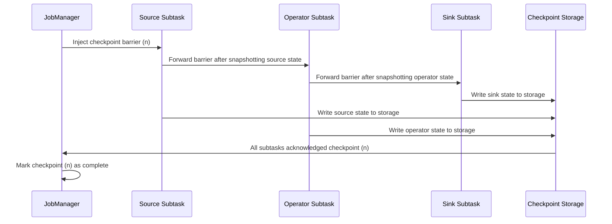
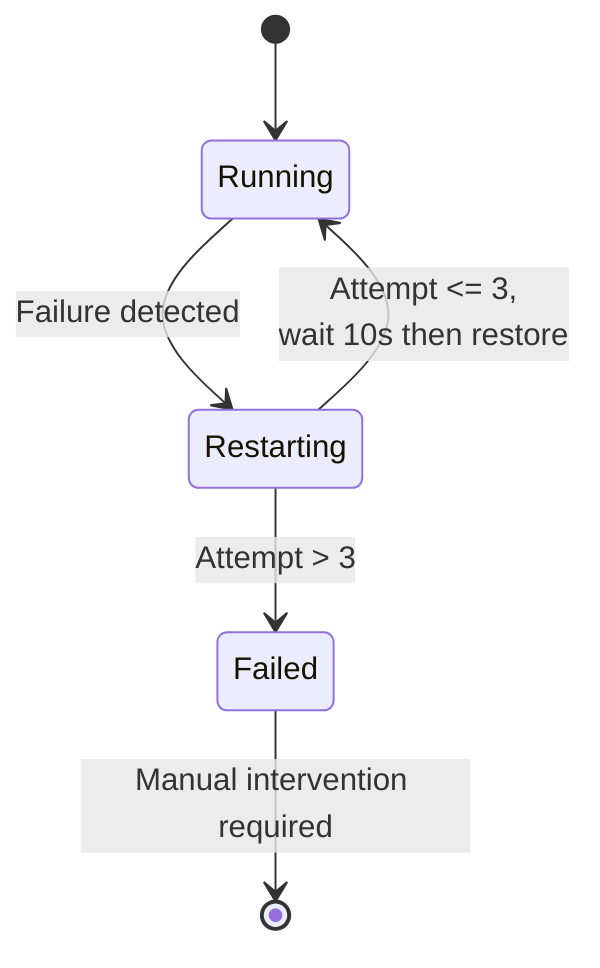
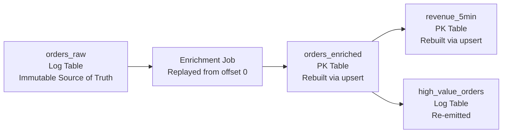
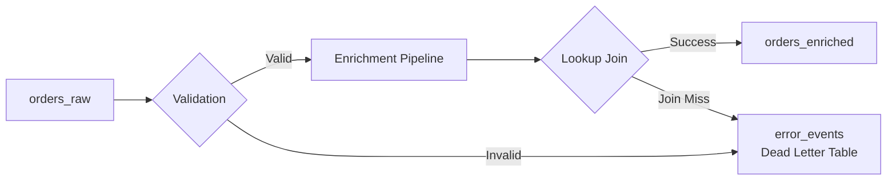

# Reliability and Fault Tolerance Guide

This document describes how the Real-Time E-commerce Order Intelligence Platform handles failures, ensures data consistency, and recovers from disruptions.

---

## Table of Contents

1. [Failure Scenarios](#failure-scenarios)
2. [Flink Checkpointing](#flink-checkpointing)
3. [Restart Strategies](#restart-strategies)
4. [Replay from Raw Events](#replay-from-raw-events)
5. [Idempotent Inserts via PK Tables](#idempotent-inserts-via-pk-tables)
6. [Exactly-Once Semantics](#exactly-once-semantics)
7. [Disaster Recovery](#disaster-recovery)
8. [Future Improvements](#future-improvements)

---

## Failure Scenarios

The following table summarizes known failure modes, their impact, and the mitigation strategy implemented or recommended.

| Scenario | Impact | Mitigation |
|---|---|---|
| **Flink TaskManager crash** | Running subtasks on that TM are lost. In-flight records since the last checkpoint are replayed. | Flink restores from the latest checkpoint and restarts affected subtasks. The fixed-delay restart strategy retries up to 3 times with 10s delay. |
| **Flink JobManager crash** | All jobs managed by that JM are lost. No new jobs can be submitted. | JM restarts via Docker `restart: always`. Jobs can be recovered from the latest checkpoint or savepoint. In production, use JobManager HA with ZooKeeper. |
| **Fluss TabletServer crash** | Reads and writes to buckets hosted on that server fail. | TabletServer restarts automatically. Fluss replicates data across TabletServers (when replication factor > 1). During recovery, Flink sinks experience backpressure until the server is available. |
| **Fluss CoordinatorServer crash** | New table creation and metadata operations fail. Existing reads/writes may continue briefly. | CoordinatorServer restarts automatically. In production, deploy multiple coordinators behind ZooKeeper leader election. |
| **ZooKeeper failure** | Both Fluss and Flink HA lose coordination. New leader elections cannot proceed. | ZooKeeper runs as an ensemble (3 or 5 nodes) in production. The current dev setup uses a single node. |
| **Duplicate events** | The same order appears multiple times in `orders_raw`. Downstream aggregates are inflated. | PK tables (`orders_enriched`, `revenue_5min`) deduplicate by primary key via upsert semantics. Log tables do not deduplicate -- apply deduplication logic in the enrichment pipeline if needed. |
| **Late events** | Events arriving after the watermark are dropped from window aggregations. Revenue totals for closed windows may be understated. | The 5-second watermark delay (`event_time - INTERVAL '5' SECOND`) provides a buffer. Late events still land in `orders_raw` (Log table, append-only). For critical accuracy, use allowed lateness or side outputs. |
| **Bad records (malformed data)** | Invalid records cause deserialization errors or incorrect enrichment. | Schema enforcement at the Fluss catalog level rejects structurally invalid records. Semantic validation (null checks, range checks) should be added in the enrichment SQL. |
| **Schema change (breaking)** | A column type change or removal breaks running Flink jobs. | Flink SQL jobs are compiled against the schema at submission time. Schema changes require job restart with updated SQL. Use schema evolution carefully -- add nullable columns only. |

---

## Flink Checkpointing

Checkpointing is the foundation of Flink's fault tolerance. It periodically captures a consistent snapshot of the entire job's distributed state.

### How It Works



### Current Configuration

```yaml
# From docker-compose.yml
execution.checkpointing.interval: 30s
execution.checkpointing.min-pause: 10s
state.checkpoints.dir: file:///tmp/flink-checkpoints
state.savepoints.dir: file:///tmp/flink-savepoints
```

### Key Properties

| Property | Value | Purpose |
|---|:---:|---|
| Interval | 30 seconds | Time between checkpoint initiations |
| Min-pause | 10 seconds | Minimum gap between end of one checkpoint and start of the next |
| Mode | Exactly-once (default) | Barrier alignment ensures consistent snapshots |
| Storage | Local filesystem | Development only; use S3/HDFS in production |

### What Gets Checkpointed

| Component | State Content |
|---|---|
| Source (flink-faker) | Current generation position/offset |
| Source (Fluss consumer) | Bucket offsets for each partition |
| Join operator | Buffered records and lookup cache |
| Window operator | In-flight window contents and timers |
| Sink (Fluss producer) | Pre-commit transaction state |

### Recovery Process

1. Flink detects a subtask failure.
2. The restart strategy determines whether to retry.
3. All subtasks are cancelled and restarted.
4. Each subtask restores its state from the latest completed checkpoint.
5. Sources rewind to the checkpointed offsets and replay events.
6. Processing resumes from exactly the checkpoint boundary.

The **recovery time** depends on state size and storage throughput. For the default configuration with small state, recovery completes in seconds.

---

## Restart Strategies

The platform configures a fixed-delay restart strategy in `docker-compose.yml`:

```yaml
restart-strategy.type: fixed-delay
restart-strategy.fixed-delay.attempts: 3
restart-strategy.fixed-delay.delay: 10s
```

### Behavior



### Strategy Comparison

| Strategy | Behavior | Best For |
|---|---|---|
| `fixed-delay` (current) | Retry N times with fixed pause | Development, simple deployments |
| `failure-rate` | Allow M failures per time window | Production (tolerates bursts) |
| `exponential-delay` | Increasing backoff between retries | Transient external failures |
| `no-restart` | Fail immediately | Testing, CI/CD pipelines |

### Production Recommendation

Switch to `failure-rate` for production to avoid exhausting retry budget on transient failure bursts:

```yaml
restart-strategy.type: failure-rate
restart-strategy.failure-rate.max-failures-per-interval: 10
restart-strategy.failure-rate.failure-rate-interval: 5min
restart-strategy.failure-rate.delay: 15s
```

This allows up to 10 failures within any 5-minute window. If the failure rate exceeds this, the job enters `FAILED` state, signaling a systemic issue that requires human attention.

---

## Replay from Raw Events

The `orders_raw` Log table serves as the system of record. Because it is append-only and immutable, it enables full reprocessing of the pipeline from any point within its retention window.

### When to Replay

- A bug in the enrichment SQL produced incorrect results in downstream tables.
- A dimension table (`customer_profile`, `product_catalog`) was updated and you want to re-enrich historical orders.
- A new derived table is added and needs to be backfilled.

### Replay Procedure

1. **Stop** the affected Flink streaming jobs (enrichment, aggregation, or alerts).
2. **Truncate** the target PK tables (e.g., `orders_enriched`, `revenue_5min`) or create new target tables.
3. **Reset** the Fluss consumer offsets to the desired starting point (beginning of retention or a specific timestamp).
4. **Restart** the Flink jobs. They will re-read from `orders_raw` and recompute all derived tables.



### Replay Guarantees

- PK tables (`orders_enriched`, `revenue_5min`, `city_revenue_5min`) will converge to the correct state because upsert semantics overwrite stale values.
- Log tables (`high_value_orders`, `suspicious_orders`) will contain duplicate entries from the replay. Downstream consumers must handle deduplication.

---

## Idempotent Inserts via PK Tables

PK (Primary Key) tables in Fluss provide natural idempotency. Writing the same record twice with the same primary key results in an update, not a duplicate.

### How It Works

```sql
-- Writing the same order_id twice to orders_enriched
-- The second write overwrites the first -- no duplicate
INSERT INTO orders_enriched VALUES ('order-123', ...);  -- Creates row
INSERT INTO orders_enriched VALUES ('order-123', ...);  -- Updates row
```

### Idempotency by Table

| Table | Idempotent? | Key | Behavior on Duplicate Write |
|---|:---:|---|---|
| `orders_raw` | No | None (Log table) | Appends duplicate row |
| `customer_profile` | Yes | `customer_id` | Updates existing profile |
| `product_catalog` | Yes | `product_id` | Updates existing product |
| `orders_enriched` | Yes | `order_id` | Overwrites with latest enrichment |
| `revenue_5min` | Yes | `(window_start, window_end, category)` | Updates aggregate for that window |
| `city_revenue_5min` | Yes | `(window_start, window_end, city)` | Updates aggregate for that window |
| `high_value_orders` | No | None (Log table) | Appends duplicate alert |
| `suspicious_orders` | No | None (Log table) | Appends duplicate alert |

### Implications for Replay

When replaying from `orders_raw`, PK tables naturally converge to the correct state. Log tables accumulate duplicates. Design downstream consumers of `high_value_orders` and `suspicious_orders` with deduplication logic (e.g., deduplicate by `order_id` and `event_time`).

---

## Exactly-Once Semantics

Exactly-once processing means every input record affects the output exactly once, even in the presence of failures and retries.

### Flink's Guarantee

Flink provides **exactly-once state consistency** through aligned checkpoint barriers. Between checkpoints, the state and source offsets are atomically consistent. On recovery, the system restores to this consistent snapshot and replays from the checkpointed offsets.

### End-to-End Exactly-Once

End-to-end exactly-once requires cooperation from both the source and the sink.

| Component | Guarantee | Mechanism |
|---|---|---|
| Flink-faker source | At-least-once | Deterministic generation from position; replays may produce duplicates |
| Fluss source (consumer) | Exactly-once (with Flink) | Offset tracking integrated with Flink checkpoints |
| Fluss sink (producer) | Effectively exactly-once for PK tables | Upsert semantics deduplicate by primary key |
| Fluss sink (Log tables) | At-least-once | Appends are not deduplicated; replays produce duplicates |

### Practical Guidance

For this platform:

- **PK table sinks** (`orders_enriched`, `revenue_5min`, `city_revenue_5min`) achieve effectively exactly-once results because upsert semantics make duplicate writes harmless.
- **Log table sinks** (`orders_raw`, `high_value_orders`, `suspicious_orders`) achieve at-least-once. If the Flink job restarts, some events may be written twice to these tables.
- For the `flink-faker` source used in development, duplicates may occur on restart since the generator does not maintain a deterministic cursor. In production with a real source (e.g., Kafka), Flink's offset tracking provides exactly-once source consumption.

---

## Disaster Recovery

### Single-Node (Current Dev Setup)

The current `docker-compose.yml` runs all services on a single machine. This is not fault-tolerant -- a host failure loses everything.

**Recovery procedure:**
1. Restart Docker Compose: `docker compose up -d`
2. Services recover from scratch (no persistent volumes for checkpoints by default)
3. Re-run SQL scripts to recreate tables and seed data
4. Restart streaming jobs

### Production Multi-Node Setup

For production disaster recovery, implement the following:

| Component | HA Strategy | Recovery Time |
|---|---|---|
| ZooKeeper | 3-node ensemble across availability zones | Automatic (leader election), seconds |
| Fluss CoordinatorServer | Active-standby with ZooKeeper leader election | Automatic, 10-30 seconds |
| Fluss TabletServer | Replication factor >= 2, data on shared storage | Automatic, seconds to minutes |
| Flink JobManager | HA with ZooKeeper, persisted job graph | Automatic, 30-60 seconds |
| Flink TaskManager | Stateless, auto-scaling group | Automatic, 30-60 seconds |
| Checkpoint storage | S3/GCS with cross-region replication | N/A (always available) |

### Recovery Point Objective (RPO) and Recovery Time Objective (RTO)

| Scenario | RPO | RTO |
|---|---|---|
| Single TaskManager failure | 0 (checkpoint-based recovery) | 10-30 seconds |
| Single TabletServer failure | 0 (if replicated) | 10-60 seconds |
| Full cluster failure | Last checkpoint interval (30-120s of data) | 5-15 minutes |
| Region failure | Last cross-region replication lag | 15-60 minutes |

### Savepoints for Planned Maintenance

Before upgrading Flink, Fluss, or modifying job SQL, take a savepoint:

```bash
# Trigger a savepoint for a running job
flink savepoint <job-id> s3://your-bucket/flink-savepoints/

# Restore from savepoint
flink run -s s3://your-bucket/flink-savepoints/<savepoint-dir> ...
```

Savepoints are portable across Flink versions (with compatible state serializers) and serve as the checkpoint for planned migrations.

---

## Future Improvements

### Dead-Letter / Error Table

Currently, records that fail validation or enrichment are silently dropped. A dead-letter table would capture these for debugging and reprocessing.

**Proposed schema:**

```sql
CREATE TABLE error_events (
    original_order_id   STRING,
    error_type          STRING,
    error_message       STRING,
    raw_payload         STRING,
    failed_at           TIMESTAMP(3)
) WITH (
    'bucket.num' = '2'
);
```

**Error routing:**



Records in `error_events` can be periodically reviewed, corrected, and replayed into the pipeline.

### Automated Alerting on Job Failures

Integrate Flink's REST API with an alerting system:

```bash
# Poll job status
curl http://localhost:8083/jobs/<job-id> | jq '.state'
```

Alert when a job transitions to `FAILED`, `CANCELLED`, or when checkpoint failures exceed a threshold.

### Schema Registry Integration

A schema registry would enable:

- Backward and forward compatibility checks before schema changes
- Automatic schema evolution without job restarts
- Cross-team schema governance

This is not natively supported by Fluss 0.9.0-incubating but can be implemented at the application layer.
